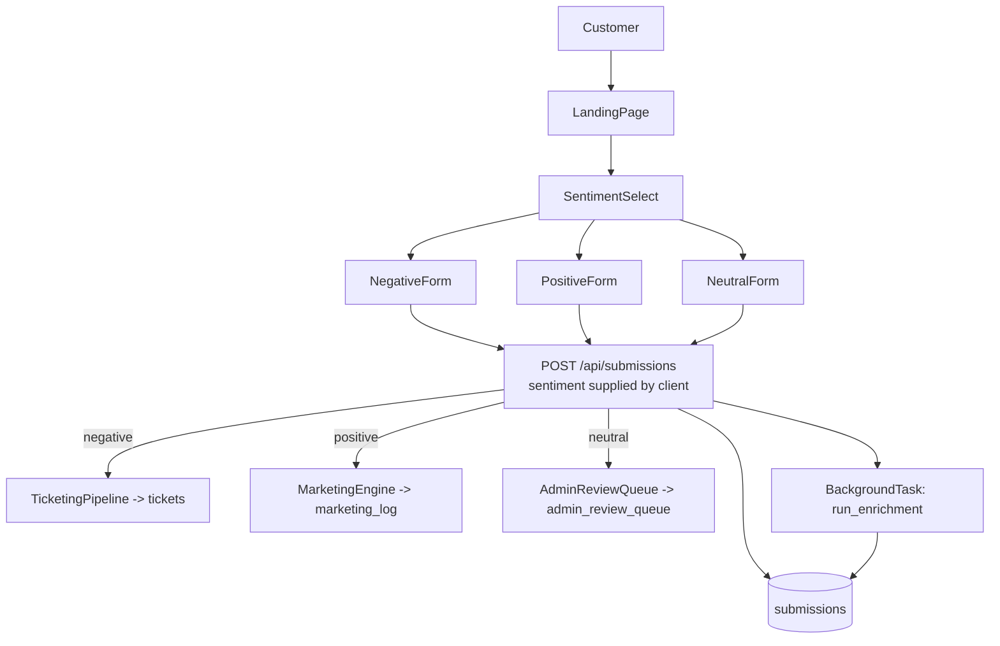
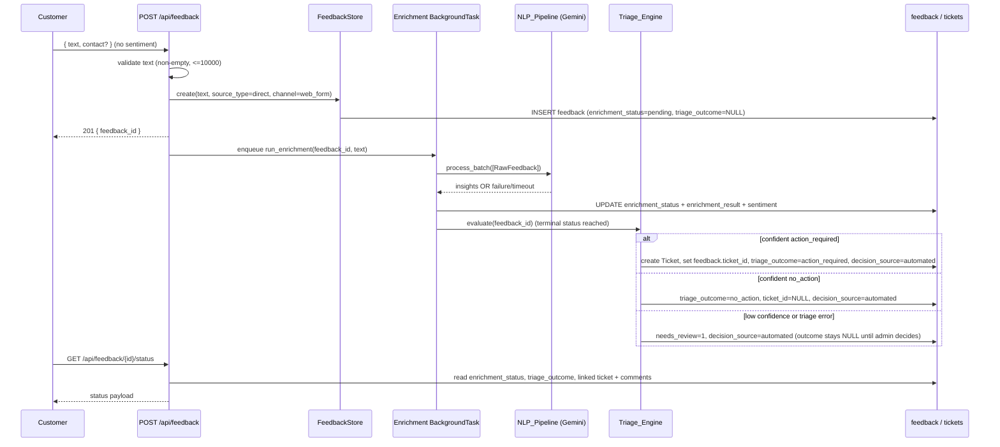
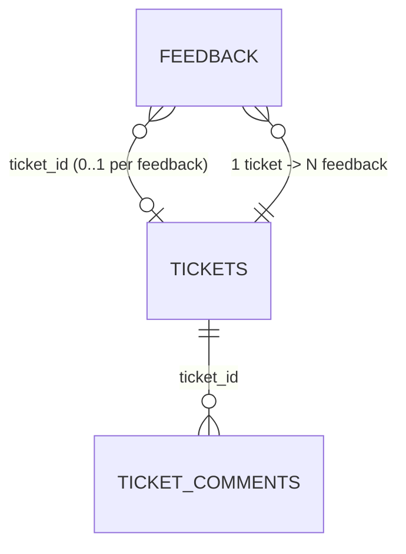

# Design Document: Feedback Triage & Ticketing Overhaul

## Overview

This design overhauls the existing Spectrum feedback application from a **customer-classified, sentiment-routed** model into an **NLP-first, triage-driven** model. It is a modification of the running system in `backend/app` (FastAPI + SQLite) and `frontend/src` (React 18 + TS + Vite), not a greenfield build. The document describes concrete schema changes, new/renamed services, endpoint remapping, frontend changes, and a non-destructive data migration.

The core behavioral shift is:

- Today, the customer picks a sentiment (`negative`/`positive`/`neutral`) in a multi-step flow (`LandingPage → SentimentSelect → Negative/Positive/NeutralForm`), the backend stores a `submission` with that self-selected `sentiment`, and downstream artifacts (ticket / marketing_log / admin_review_queue) are created *synchronously from the self-selected sentiment* in `routes/submissions.py`.
- After this overhaul, the customer submits **free-form text only**. Every submission becomes a **Feedback** record with a stable `feedback_id`. The existing Gemini enrichment pipeline (`services/enrichment.py` + `nlp_processing`) derives sentiment/themes/severity. A new **Triage_Engine** runs *after* enrichment reaches a terminal status and decides `action_required` vs `no_action`, creating or linking a **Ticket** only when action is required.

What is preserved and reused:

- The enrichment background-task machinery in `services/enrichment.py` (Gemini model-priority fallback via `GEMINI_MODEL_PRIORITY`, 30s timeout, `pending/completed/failed/timeout` statuses) is reused unchanged in behavior; only its persistence target moves from `submissions` to `feedback`.
- The session-token auth stack (`services/auth_service.py`, `middleware/auth.py`, `context/AuthContext.tsx`) is preserved as-is (Requirement 11.4).
- The marketing engine and trend analysis remain available over the unified model (Requirement 11).
- `nlp_processing/ingestion/social_listener.py` already emits `SocialFeedback` with `platform ∈ {reddit, x, facebook}`; the design adds a persistence path that writes those into the `feedback` table with `source_type = "social"` (Requirement 6).

Requirements coverage: this design addresses Requirements 1–12. Each section references the specific acceptance criteria it satisfies.

## Architecture

### Current architecture (before)



### Target architecture (after)

```mermaid
flowchart TD
    C[Customer] --> FF[FeedbackForm single free-form text]
    FF --> POST[POST /api/feedback\nNO sentiment from client]
    SL[SocialListener SocialFeedback] --> ING[Feedback ingestion adapter]
    POST --> FS[FeedbackStore.create]
    ING --> FS
    FS --> DB[(feedback)]
    FS --> BG[BackgroundTask: run_enrichment writes feedback]
    BG -->|terminal status reached| TE[Triage_Engine.evaluate]
    TE -->|action_required, confident| TK[create or link Ticket]
    TE -->|no_action, confident| KEEP[retain feedback-only]
    TE -->|low confidence / triage error| REV[route to admin review\nneeds_review=1, decision_source=automated]
    TK --> DB
    REV --> ADM[Admin_Dashboard manual triage]
    ADM -->|action_required| TK2[create/link Ticket\ndecision_source=admin]
    ADM -->|no_action| KEEP2[retain feedback-only\ndecision_source=admin]
    DB --> SV[Status_View GET /api/feedback/{id}/status]
    DB --> TREND[Trend_Analysis / Marketing]
```

### Layering and where code changes land

| Layer | Existing file(s) | Change |
| --- | --- | --- |
| Schema | `backend/app/schema.sql` | Add `feedback`, `ticket_comments`; make `tickets` independent; keep legacy tables intact for migration |
| Models | `backend/app/models/submission.py`, `models/ticket.py` | Add `models/feedback.py` (Feedback, FeedbackCreate, StatusView), extend `Ticket`, add `TicketComment` |
| Feedback persistence | `services/submission_store.py` | Introduce `services/feedback_store.py` (evolution of SubmissionStore) writing to `feedback` |
| Enrichment | `services/enrichment.py` | Keep pipeline behavior; change store target to `feedback`; on terminal status invoke Triage_Engine |
| Triage | *(new)* | Add `services/triage_engine.py` |
| Tickets | `services/ticketing_pipeline.py` | Support many-to-one linkage + comments; drop the mandatory 1:1 `submission_id` FK |
| Comments | *(new)* | Add `services/ticket_comment_store.py` |
| Social | `nlp_processing/ingestion/social_listener.py` | Unchanged; add adapter that persists SocialFeedback into `feedback` |
| Routes | `routes/submissions.py`, `routes/admin.py` | Replace `/api/submissions` with `/api/feedback`; add comments + triage + status endpoints |
| Frontend | `App.tsx`, `pages/*`, `api/client.ts` | Replace sentiment flow with single form; add comments to status view; surface source/platform in admin |

### Request/processing sequence (submit → enrich → triage → ticket|feedback-only → status)



## Components and Interfaces

### FeedbackStore (`services/feedback_store.py`, evolves `submission_store.py`)

Responsible for CRUD on the `feedback` table. Mirrors the existing `SubmissionStore` shape so the migration is mechanical.

```python
class FeedbackStore:
    def create(self, data: FeedbackCreate, *, source_type="direct", channel="web_form",
               platform: str | None = None) -> Feedback: ...
    def create_from_social(self, sf: SocialFeedback) -> Feedback: ...   # Req 6.1, 6.5
    def get(self, feedback_id: UUID) -> Feedback | None: ...            # Req 4.4
    def get_status_view(self, feedback_id: UUID) -> StatusView | None:  # Req 9.1-9.4
        ...
    def update_enrichment(self, feedback_id: UUID, result: EnrichmentResult,
                          sentiment: str) -> None: ...                  # Req 2.2, 2.3
    def mark_enrichment_failed(self, feedback_id: UUID, reason: str,
                               status: Literal["failed","timeout"]) -> None: ...  # Req 2.6, 2.7
    def set_triage(self, feedback_id: UUID, outcome: str | None, *,
                   decision_source: str, needs_review: bool) -> None: ... # Req 3.8
    def link_ticket(self, feedback_id: UUID, ticket_id: UUID) -> None: ... # Req 5.3, 5.4, 5.7
    def list_for_admin(self, limit, offset) -> list[FeedbackAdminRow]: ...  # Req 10.1
    def list_needs_review(self, limit, offset) -> list[Feedback]: ...       # Req 10.2
    def aggregate_counts(self) -> dict: ...                                  # Req 10.3
```

Key behavior: `create` never accepts a `sentiment` argument (Requirement 2.4). Sentiment starts `NULL` and is only written by `update_enrichment`.

### Triage_Engine (`services/triage_engine.py`, new)

A pure decision function plus a thin persistence wrapper. The pure core is deliberately simple and deterministic so it is unit- and property-testable without touching Gemini or the DB.

```python
@dataclass(frozen=True)
class TriageInput:
    enrichment_status: str            # completed | failed | timeout
    sentiment: str | None             # positive | neutral | negative | None
    severity_score: int | None        # 1..5
    themes: list[str]

@dataclass(frozen=True)
class TriageDecision:
    outcome: str | None               # "action_required" | "no_action" | None (=> needs review)
    needs_review: bool
    decision_source: str              # always "automated" for the engine

def decide(inp: TriageInput) -> TriageDecision: ...
```

Automated decision rule (concrete and simple):

1. If `enrichment_status != "completed"` (i.e. `failed`/`timeout`) → `needs_review=True`, `outcome=None` (Requirement 3.9 / 2.6 / 2.7 — cannot triage without analysis).
2. Else if `sentiment == "negative"` **and** `severity_score >= ACTION_SEVERITY_THRESHOLD` (default 3) → `outcome="action_required"`.
3. Else if `sentiment in {"positive","neutral"}` **and** `severity_score <= NO_ACTION_SEVERITY_MAX` (default 2) → `outcome="no_action"`.
4. Else (ambiguous: negative-but-low-severity, or missing severity/sentiment, or borderline severity) → `needs_review=True`, `outcome=None` (Requirement 3.5).

Thresholds live in module constants (env-overridable) so the "confidence band" is explicit and testable. The engine itself always sets `decision_source="automated"`; a later admin decision overwrites `decision_source="admin"` (Requirement 3.6–3.8).

Persistence wrapper `run_triage(feedback_id)`:

- Loads the feedback row, builds `TriageInput`, calls `decide`.
- `action_required` → calls `TicketingPipeline.create_ticket(feedback_id, ...)` and links (Requirement 3.2, 5.3), sets `triage_outcome`, `decision_source=automated`, `needs_review=0`.
- `no_action` → sets `triage_outcome=no_action`, leaves `ticket_id` NULL (Requirement 3.3, 5.5).
- `needs_review` → sets `needs_review=1`, `decision_source=automated`, `triage_outcome` stays NULL until admin acts (Requirement 3.5).
- Any exception inside `run_triage` is caught → `needs_review=1` (Requirement 3.9).

### Enrichment wiring (`services/enrichment.py`)

`run_enrichment` keeps its current structure but: (a) calls `FeedbackStore` instead of `SubmissionStore`; (b) on completion also records the NLP-derived `sentiment`; (c) after writing any terminal status (`completed`/`failed`/`timeout`), invokes `TriageEngine.run_triage(feedback_id)` (Requirement 3.1). Timeout stays 30s; model-priority fallback and graceful failure are untouched (Requirement 2.8).

### TicketingPipeline (`services/ticketing_pipeline.py`)

Modified so tickets are independent of any single feedback:

```python
class TicketingPipeline:
    def create_ticket(self, *, feedback_id: str, issue_category: str,
                      description: str, priority="high") -> Ticket: ...   # links feedback (Req 5.3)
    def link_feedback(self, ticket_id: str, feedback_id: str) -> None: ... # Req 5.4, 5.7
    def advance_status(self, ticket_id: str) -> Ticket: ...                # Req 10.5
    def list_active_with_counts(self) -> list[TicketWithCount]: ...        # Req 10.4
    def get_with_feedback_ids(self, ticket_id: str) -> TicketDetail | None # Req 5.6
```

Linkage is enforced on the **feedback** side: `feedback.ticket_id` FK is nullable and holds at most one ticket, giving 1 ticket → N feedback and each feedback → 0..1 ticket (Requirement 5.1, 5.2). The old status→progress side effects on `submissions` are removed; ticket status is surfaced through the Status_View instead.

### TicketCommentStore (`services/ticket_comment_store.py`, new)

```python
class TicketCommentStore:
    def add(self, ticket_id: str, author: str, text: str) -> TicketComment: ... # Req 7.1
    def list_for_ticket(self, ticket_id: str) -> list[TicketComment]:          # Req 7.5, 8.5
        # ordered by created_at ASC, tie-broken by autoincrement id
        ...
```

### Social ingestion adapter

`SocialListener` stays unchanged. A small adapter maps a `SocialFeedback` into `FeedbackCreate`-equivalent fields and calls `FeedbackStore.create_from_social`, setting `source_type="social"`, `platform` from the record, `channel=NULL` (Requirement 6.1, 6.5). Enrichment + triage then run identically to direct feedback.

### API surface

Auth rules: comment creation, admin triage, ticket listing/advancing, dashboard, marketing, trends all require `Depends(require_admin)` (Requirement 7.4, 11.4). Feedback creation and the status view are public.

Old → new endpoint mapping:

| Old | New | Notes |
| --- | --- | --- |
| `POST /api/submissions` (with `sentiment`) | `POST /api/feedback` (text + optional contact, **no sentiment**) | Req 1, 2.4 |
| `GET /api/submissions/{id}/status` | `GET /api/feedback/{id}/status` | Req 9 — adds triage outcome, linked ticket status, comments |
| `GET /api/submissions/{id}` (admin) | `GET /api/admin/feedback/{id}` | Full feedback record |
| `GET /api/admin/queue` | `GET /api/admin/review` | Feedback where `needs_review=1` (Req 10.2) |
| `PATCH /api/admin/queue/{id}/sort` | `PATCH /api/admin/feedback/{id}/triage` | Body: `{ outcome, ticket_id? }` (Req 3.6, 3.7) |
| `GET /api/admin/tickets` | `GET /api/admin/tickets` | Now includes `linked_feedback_count` (Req 10.4) |
| `PATCH /api/admin/tickets/{id}/advance` | `PATCH /api/admin/tickets/{id}/advance` | Reflected in all linked feedback status (Req 10.5) |
| *(none)* | `POST /api/admin/tickets/{id}/comments` | Create comment (Req 7) |
| *(none)* | `GET /api/admin/tickets/{id}/comments` | List comments (Req 7.5) |
| `GET /api/admin/dashboard` | `GET /api/admin/dashboard` | Counts by sentiment + triage_outcome (Req 10.3) |
| `GET /api/admin/marketing` | `GET /api/admin/marketing` | Sourced from positive feedback (Req 11.3) |
| `POST /api/admin/trends` | `POST /api/admin/trends` | Over all feedback incl. no_action (Req 11.1, 11.2) |

New request/response bodies:

```jsonc
// POST /api/feedback  request
{ "text": "my internet keeps dropping", "contact": "a@b.com" }   // contact optional
// POST /api/feedback  201 response
{ "feedback_id": "uuid", "message": "Feedback received." }

// GET /api/feedback/{id}/status  response
{
  "feedback_id": "uuid",
  "enrichment_status": "completed",
  "triage_outcome": "action_required",      // or "no_action" or null
  "ticket": { "ticket_id": "uuid", "status": "in_progress" } | null,
  "comments": [ { "author": "admin", "created_at": "...", "text": "..." } ],
  "analysis_in_progress": false             // true while enrichment_status == pending (Req 9.4)
}

// PATCH /api/admin/feedback/{id}/triage  request  (admin)
{ "outcome": "action_required", "ticket_id": "uuid-or-omitted" }
```

### Frontend changes

- **Single form**: add `pages/FeedbackForm.tsx` — one textarea + optional contact field, calling `createFeedback`. It replaces the `LandingPage → SentimentSelect → Negative/Positive/NeutralForm` flow. `SentimentSelect.tsx`, `NegativeForm.tsx`, `PositiveForm.tsx`, `NeutralForm.tsx` are removed and their routes (`/sentiment`, `/negative`, `/positive`, `/neutral`) deleted from `App.tsx`. `LandingPage` becomes a thin wrapper that renders the feedback form (or redirects `/` → form). No sentiment appears anywhere in the create payload (Requirement 1.2, 2.4).
- **Status view**: `StatusTracker.tsx` / `StatusLookup.tsx` keyed by `feedback_id` (Requirement 9); render enrichment status, triage outcome, linked ticket status, and the ticket's comments with author + timestamp, or a "no ticket associated" message (Requirement 8.1–8.5).
- **Admin views**: `SubmissionDetail` → `FeedbackDetail` gains a comments panel (list + create) and displays source/platform. `ReviewQueue` lists `needs_review` feedback with a triage action. `TicketList` shows `linked_feedback_count`. Admin list rows show `source_type`; for `social` show `platform`, for `direct` show `channel`; missing platform renders as empty (no placeholder) (Requirement 6.2, 6.3, 6.4).
- `api/client.ts`: replace `createSubmission`/`getSubmissionStatus` with `createFeedback`/`getFeedbackStatus`; add `createComment`, `listComments`, `submitTriage`, `getReviewList`.

## Data Models

### New and changed tables (SQLite DDL)

Added to `backend/app/schema.sql`. Legacy tables (`submissions`, `state_transitions`, `admin_review_queue`, `marketing_log`) are **kept** so migration is non-destructive (Requirement 12.7). The `tickets` table is redefined to be feedback-linked via the feedback side.

```sql
-- Unified feedback record (replaces the role of `submissions`)
CREATE TABLE IF NOT EXISTS feedback (
    feedback_id TEXT PRIMARY KEY,               -- UUID (Req 4.1, 4.3)
    text TEXT NOT NULL,                          -- free-form message (Req 1.1)
    source_type TEXT NOT NULL DEFAULT 'direct'
        CHECK(source_type IN ('direct','social')),          -- Req 6.1
    channel TEXT,                                -- e.g. 'web_form' for direct (Req 1.7)
    platform TEXT
        CHECK(platform IS NULL OR platform IN ('reddit','x','facebook')),  -- Req 6.1, 6.5
    created_at TEXT NOT NULL,                    -- ISO 8601 UTC (Req 2 / migration 12.2)
    enrichment_status TEXT NOT NULL DEFAULT 'pending'
        CHECK(enrichment_status IN ('pending','completed','failed','timeout')),  -- Req 2.5-2.7
    enrichment_result TEXT,                      -- JSON blob (Req 2.2)
    sentiment TEXT
        CHECK(sentiment IS NULL OR sentiment IN ('positive','neutral','negative')),  -- Req 2.3 (NLP-only)
    triage_outcome TEXT
        CHECK(triage_outcome IS NULL OR triage_outcome IN ('action_required','no_action')),  -- Req 3.1
    triage_decision_source TEXT
        CHECK(triage_decision_source IS NULL OR triage_decision_source IN ('automated','admin')),  -- Req 3.8
    needs_review INTEGER NOT NULL DEFAULT 0,     -- routed to admin triage (Req 3.5, 3.9)
    ticket_id TEXT REFERENCES tickets(ticket_id) -- 0..1 ticket per feedback (Req 5.1, 5.7)
);
CREATE INDEX IF NOT EXISTS idx_feedback_ticket ON feedback(ticket_id);
CREATE INDEX IF NOT EXISTS idx_feedback_needs_review ON feedback(needs_review);

-- Independent tickets (many feedback -> one ticket)
CREATE TABLE IF NOT EXISTS tickets (
    ticket_id TEXT PRIMARY KEY,                  -- UUID (Req 5)
    issue_category TEXT NOT NULL,
    description TEXT NOT NULL,
    priority TEXT NOT NULL DEFAULT 'high',
    status TEXT NOT NULL DEFAULT 'open'
        CHECK(status IN ('open','in_progress','resolved')),
    created_at TEXT NOT NULL
);

-- Internal staff comments on tickets (Req 7)
CREATE TABLE IF NOT EXISTS ticket_comments (
    id INTEGER PRIMARY KEY AUTOINCREMENT,        -- tie-breaker for equal timestamps
    ticket_id TEXT NOT NULL REFERENCES tickets(ticket_id),  -- exactly one ticket (Req 7.6)
    author TEXT NOT NULL,                        -- admin username (Req 7.1)
    created_at TEXT NOT NULL,                    -- ISO 8601 UTC (Req 7.1)
    text TEXT NOT NULL                           -- non-empty enforced in service (Req 7.2)
);
CREATE INDEX IF NOT EXISTS idx_ticket_comments_ticket ON ticket_comments(ticket_id, created_at);
```

Note: because the new `tickets` table uses `ticket_id` as PK (vs the legacy `tickets.id` with a mandatory `submission_id`), the migration writes into a fresh `tickets` definition. If the legacy `tickets` table must be retained verbatim, migration creates the new tables under the names above and the legacy `tickets` is left untouched (see Migration Plan).

### ER-style relationships



- Each `feedback` row references at most one `tickets` row (nullable FK). → each Feedback → 0..1 Ticket (Requirement 5.1).
- Many `feedback` rows may share the same `ticket_id`. → 1 Ticket → N Feedback (Requirement 5.2).
- Each `ticket_comments` row references exactly one `tickets` row (Requirement 7.6).

### Pydantic models (`backend/app/models/feedback.py`, new)

```python
class FeedbackCreate(BaseModel):
    text: str = Field(min_length=1, max_length=10000)     # Req 1.4, 1.5
    contact: str | None = None
    # NOTE: no `sentiment` field exists here by design (Req 2.4)

class Feedback(BaseModel):
    feedback_id: UUID
    text: str
    source_type: Literal["direct","social"]
    channel: str | None = None
    platform: Literal["reddit","x","facebook"] | None = None
    created_at: datetime
    enrichment_status: Literal["pending","completed","failed","timeout"] = "pending"
    enrichment_result: EnrichmentResult | None = None
    sentiment: Literal["positive","neutral","negative"] | None = None
    triage_outcome: Literal["action_required","no_action"] | None = None
    triage_decision_source: Literal["automated","admin"] | None = None
    needs_review: bool = False
    ticket_id: UUID | None = None

class TicketComment(BaseModel):
    id: int
    ticket_id: UUID
    author: str
    created_at: datetime
    text: str

class TriageRequest(BaseModel):
    outcome: Literal["action_required","no_action"]
    ticket_id: UUID | None = None      # link to existing ticket instead of creating

class CommentCreate(BaseModel):
    text: str = Field(min_length=1)    # whitespace rejected in service (Req 7.2)
```

`EnrichmentResult` is reused unchanged from `models/submission.py`.

### Validation rules (Requirement 1)

- `text` empty/whitespace-only → 422 identifying the `text` field; no row created (Requirement 1.4, 1.6).
- `text` length > 10000 → 422 identifying the length limit; no row created (Requirement 1.5).
- When both conditions hold, the submission is still rejected and no row created (Requirement 1.6).
- Whitespace-only detection is done in the route/service (Pydantic `min_length` alone does not strip), matching the existing neutral-comment `strip()` check.

## Migration Plan

A standalone, re-runnable script `backend/app/migrations/migrate_to_feedback.py` (invocable as `python -m app.migrations.migrate_to_feedback`) performs a **non-destructive** copy. It never drops or mutates `submissions`, `state_transitions`, `admin_review_queue`, or `marketing_log` (Requirement 12.7). It is idempotent: it records a deterministic mapping from `submissions.id` → `feedback.feedback_id` (reusing the legacy UUID as the new `feedback_id`) and uses `INSERT OR IGNORE`, so re-running does not duplicate rows.

Field mapping (Requirement 12):

| Legacy `submissions` | New `feedback` | Rule |
| --- | --- | --- |
| `id` | `feedback_id` | Reuse UUID (Req 12.1) — makes migration idempotent |
| `core_request` (+ description/comment/praise) | `text` | Preserve original text (Req 12.2) |
| `created_at` | `created_at` | Preserve timestamp (Req 12.2) |
| `enrichment_result` | `enrichment_result` | Preserve existing enrichment (Req 12.2) |
| `enrichment_status` | `enrichment_status` | Preserve |
| `sentiment` (self-selected) | `sentiment` | Retained only where no NLP-derived sentiment exists (Req 12.3) |
| — | `source_type='direct'`, `channel='web_form'` | No social attribution (Req 12.5) |
| in `admin_review_queue`? | `needs_review=1`, `triage_outcome=NULL`, `decision_source=NULL` | Preserve pending-review state (Req 12.6) |
| not queued, has ticket | `triage_outcome='action_required'`, `ticket_id=<migrated>` | Derived from legacy ticket link |
| not queued, no ticket | `triage_outcome=NULL`, `needs_review=1` | Safe default: route to admin (no self-sentiment trust for triage) |

Ticket migration (Requirement 12.4): each legacy `tickets` row is copied into the new `tickets` table with a new/kept `ticket_id`, and the originating feedback (mapped from `tickets.submission_id`) gets `feedback.ticket_id` set, establishing the link.

Migration steps:
1. `init_db()` to ensure new tables exist alongside legacy ones.
2. Copy submissions → feedback (mapping above), `INSERT OR IGNORE` on `feedback_id`.
3. Copy tickets → tickets (new shape), set `feedback.ticket_id` on the originating feedback.
4. Report counts: rows read vs rows written, so an operator can confirm parity (supports the migration count property below).

Rollback is trivial because legacy tables are untouched; dropping the new tables restores the prior state.

## Correctness Properties

*A property is a characteristic or behavior that should hold true across all valid executions of a system-essentially, a formal statement about what the system should do. Properties serve as the bridge between human-readable specifications and machine-verifiable correctness guarantees.*

This overhaul contains a substantial amount of pure, input-varying logic (validation, the triage decision core, comment ordering, source/platform display selection, and migration mapping) that is well suited to property-based testing. The backend uses **Hypothesis** (Python) and the frontend uses **fast-check** (TypeScript). Each property below states its invariant, the requirement(s) it validates, and where it is exercised. Every property-based test runs a minimum of 100 iterations and is tagged with the format **Feature: feedback-triage-ticketing, Property {number}: {property_text}**.

Infrastructure-flavored criteria (auth-stack preservation, "display in a React component" wiring) are covered by integration/example tests in the Testing Strategy rather than as properties.

### Property 1: Unique feedback_id for every created feedback

*For any* sequence of valid feedback creations (direct or social), every created Feedback record has a non-null `feedback_id`, and the set of all assigned `feedback_id` values contains no duplicates.

**Validates: Requirements 4.1, 4.2, 4.3**
Tested in `backend/tests/test_feedback_store_props.py` (Hypothesis) against an in-memory SQLite `FeedbackStore`.

### Property 2: Sentiment is never client-supplied and starts NULL

*For any* `POST /api/feedback` request body — including bodies that add an extra `sentiment` (or `triage_outcome`) field — the created Feedback record's `sentiment` is `NULL` immediately after creation (before enrichment runs), and the stored sentiment never equals a client-provided value. Sentiment only becomes non-null via `update_enrichment`.

**Validates: Requirements 2.3, 2.4**
Tested in `backend/tests/test_feedback_api_props.py` (Hypothesis + FastAPI TestClient with enrichment stubbed out / not yet run).

### Property 3: Validation failures create no row

*For any* input text that is empty, whitespace-only, longer than 10000 characters, or simultaneously empty-and-too-long, `POST /api/feedback` returns a 4xx validation response identifying the offending field/limit, and the total feedback row count is unchanged by the request.

**Validates: Requirements 1.4, 1.5, 1.6**
Tested in `backend/tests/test_feedback_api_props.py` (Hypothesis generators for whitespace strings, oversized strings, and the empty+oversized edge case).

### Property 4: no_action feedback never has a ticket link

*For any* Feedback record whose `triage_outcome` is `no_action` (whether decided by the automated engine or by an admin), its `ticket_id` is `NULL`.

**Validates: Requirements 3.3, 5.5**
Tested in `backend/tests/test_triage_props.py` and `backend/tests/test_feedback_store_props.py`.

### Property 5: A feedback links to at most one ticket at any time

*For any* sequence of link operations applied to a single Feedback record, at most one `ticket_id` is associated with that feedback at any point; attempting to link a feedback that is already linked either replaces the single link atomically or is rejected, and never results in two simultaneous ticket associations.

**Validates: Requirements 5.1, 5.7**
Tested in `backend/tests/test_ticket_linkage_props.py` (Hypothesis stateful/sequence generation of link calls).

### Property 6: Linking to any valid ticket succeeds regardless of its current link count

*For any* valid existing Ticket — including one with zero currently linked Feedback records — and any unlinked Feedback record, `link_feedback` succeeds and afterward the Ticket's linked-feedback set contains that `feedback_id`; a Ticket may accumulate N distinct linked feedback.

**Validates: Requirements 5.2, 5.7**
Tested in `backend/tests/test_ticket_linkage_props.py`.

### Property 7: Triage decide() is total and deterministic

*For any* `TriageInput` (any combination of `enrichment_status ∈ {completed, failed, timeout}`, `sentiment ∈ {positive, neutral, negative, None}`, `severity_score ∈ {None, 1..5}`, arbitrary `themes`), `decide()` returns exactly one `TriageDecision` whose `outcome` is one of `action_required`, `no_action`, or `None` (needs review), calling `decide()` twice on equal inputs yields equal results, and whenever `enrichment_status != "completed"` (failed/timeout) the result is `needs_review=True` with `outcome=None`.

**Validates: Requirements 3.1, 3.5, 3.9**
Tested in `backend/tests/test_triage_props.py` (Hypothesis) against the pure core with no DB and no Gemini.

### Property 8: Triage decision_source recording

*For any* Feedback record routed to review by the automated engine, its `triage_decision_source` is recorded as `"automated"` and `triage_outcome` remains `NULL`; *for any* subsequent admin manual decision on that record, the persisted `triage_decision_source` becomes `"admin"` and `triage_outcome` is one of `action_required`/`no_action`.

**Validates: Requirements 3.8**
Tested in `backend/tests/test_triage_props.py` (sequence: automated route-to-review then admin decision).

### Property 9: Ticket comments are returned in ascending created_at order

*For any* set of Ticket_Comments added to a ticket (with arbitrary, possibly equal timestamps), `list_for_ticket` returns them sorted by `created_at` ascending, with ties broken deterministically by the autoincrement `id`, so the ordering is stable and total.

**Validates: Requirements 7.5, 8.5**
Tested in `backend/tests/test_comment_store_props.py` (Hypothesis generates out-of-order and equal-timestamp comment batches).

### Property 10: Customer status comment visibility and shared-ticket sharing

*For any* Feedback record: if it is linked to a Ticket, its Status_View payload contains that Ticket's comments (ascending order); if it is not linked, the payload carries the "no ticket associated" indication and an empty comment list. *For any* Ticket with multiple linked Feedback records, each linked feedback's Status_View exposes the same set of the ticket's comments.

**Validates: Requirements 8.1, 8.2, 8.4**
Tested in `backend/tests/test_status_view_props.py` (Hypothesis builds feedback/ticket/comment graphs) and `frontend/src/__tests__/StatusTracker.props.test.tsx` (fast-check for the render-model mapping).

### Property 11: Platform/channel display selection

*For any* Feedback record: if `source_type == "social"` the platform display equals the record's platform, and if the platform is missing/null the platform field renders as the empty string with no placeholder; if `source_type == "direct"` the display shows the channel. The display function never emits placeholder text for a missing platform and never throws.

**Validates: Requirements 6.2, 6.3, 6.4**
Tested in `frontend/src/__tests__/sourceDisplay.props.test.ts` (fast-check over generated `source_type`/`platform`/`channel` combinations, including null platform).

### Property 12: Migration parity and idempotency

*For any* seeded legacy database of `submissions` (and their `tickets`), running the migration preserves every submission's text and produces exactly one Feedback per submission (count parity: feedback rows written == submissions read); because the legacy UUID is reused as `feedback_id` with `INSERT OR IGNORE`, running the migration a second time inserts zero additional feedback or ticket rows (idempotence), and legacy tables remain present and unmodified.

**Validates: Requirements 12.1, 12.2, 12.7**
Tested in `backend/tests/test_migration_props.py` (Hypothesis generates legacy datasets; migration is run once, asserted, then run again to assert no growth).

## Error Handling

Error handling is designed so that no failure path silently drops feedback and every terminal-but-uncertain state routes to a human. Requirement references are inline.

### Feedback creation validation (Requirement 1.4, 1.5, 1.6)

- `FeedbackCreate` enforces `text` length via Pydantic (`min_length=1`, `max_length=10000`). Pydantic validation errors surface as FastAPI's standard **422** with a body identifying the field (`text`) and the failing constraint (empty vs length limit).
- Whitespace-only text passes `min_length` but is rejected in the route/service with an explicit **422** whose detail names the `text` field, matching the existing neutral-comment `strip()` behavior.
- When text is simultaneously empty and over-length, validation still fails and returns **422**; in all rejection cases the route returns **before** any `FeedbackStore.create` call, so no row is written (Requirement 1.6).

### NLP enrichment failure and timeout (Requirement 2.5, 2.6, 2.7, 2.8)

- Enrichment runs in a background task. While incomplete, `enrichment_status` stays `pending` and the Status_View reports "analysis in progress" (Requirement 9.4).
- A Gemini/pipeline exception is caught in `run_enrichment`; the feedback is retained with its original text and `enrichment_status="failed"`, plus a stored failure reason (Requirement 2.6).
- Exceeding the existing 30s timeout sets `enrichment_status="timeout"`, again retaining the original text (Requirement 2.7).
- Model-priority fallback and graceful degradation in `services/enrichment.py` are preserved unchanged (Requirement 2.8). In all cases enrichment reaching a terminal status (`completed`/`failed`/`timeout`) triggers triage.

### Triage failures (Requirement 3.5, 3.9)

- The pure `decide()` core is total (Property 7) and cannot raise on valid `TriageInput`; ambiguous inputs deterministically produce `needs_review`.
- Non-completed enrichment (`failed`/`timeout`) cannot be triaged automatically and is routed to admin review with `decision_source="automated"`, `outcome=NULL` (Requirement 3.9 / 2.6 / 2.7).
- The persistence wrapper `run_triage` wraps all DB/ticket operations in a try/except; any exception is caught and the feedback is set to `needs_review=1` (retained, routed to admin) rather than lost (Requirement 3.9).

### Ticket-not-found and comment validation (Requirement 7.2, 7.3)

- `POST /api/admin/tickets/{id}/comments` against a non-existent `ticket_id` returns **404** (Requirement 7.3).
- `CommentCreate` requires `min_length=1`; empty or whitespace-only text is rejected with **422** after a service-side `strip()` check, and no comment row is created (Requirement 7.2).

### Auth failures on admin endpoints (Requirement 7.4, 11.4)

- Comment creation, admin triage, ticket listing/advancing, dashboard, marketing, and trends depend on `require_admin`. Missing or invalid session tokens yield **401** via the preserved `middleware/auth.py` stack; no side effects occur (Requirement 7.4, 11.4).

### Status lookup not-found (Requirement 9.3)

- `GET /api/feedback/{id}/status` for an unknown `feedback_id` returns **404**. A valid id with no linked ticket returns **200** with a "no ticket associated" indication and an empty comment list (Requirement 8.2).

### Migration errors (Requirement 12.7)

- The migration is non-destructive: it only reads legacy tables and writes new ones, never dropping or mutating `submissions`, `state_transitions`, `admin_review_queue`, or `marketing_log`.
- It is re-runnable: reusing the legacy UUID as `feedback_id` with `INSERT OR IGNORE` makes re-runs no-ops on already-migrated rows.
- A failure partway through leaves legacy data intact; because inserts are idempotent, the migration can simply be re-run after the cause is fixed. Row-count reporting (read vs written) lets an operator detect partial runs.

## Testing Strategy

Testing uses a dual approach: example-based unit tests for concrete behaviors and edge cases, property-based tests for universal invariants, and integration tests for end-to-end wiring. Property-based tests use **Hypothesis** (backend) and **fast-check** (frontend), each configured for a minimum of 100 iterations and tagged **Feature: feedback-triage-ticketing, Property {number}: {property_text}**. No test performs real network I/O.

### Test doubles and isolation

- **Gemini/enrichment is faked** in all tests: `services/enrichment.py` is exercised with a stubbed pipeline that returns canned `EnrichmentResult`s or raises/timeouts on demand. No test contacts Google Gemini.
- **The triage pure core (`decide`) is tested with no DB and no network** — it takes a `TriageInput` and returns a `TriageDecision`, so property tests can hammer it cheaply across the full input space.
- **Database tests use in-memory / temp-file SQLite** initialized from `schema.sql`, so `FeedbackStore`, `TicketingPipeline`, and `TicketCommentStore` run against a real schema without external services.
- **Migration is tested against a seeded legacy DB**: a fixture creates the legacy `submissions`/`tickets`/`admin_review_queue` tables, seeds Hypothesis-generated rows, runs `migrate_to_feedback`, and asserts parity/idempotency.

### Unit tests (examples, edge cases, error conditions)

Backend (`backend/tests/`):
- `test_feedback_api.py` — 201 happy path returns `feedback_id`; 422 for empty, whitespace, and >10000-char; direct feedback gets `source_type="direct"`, `channel="web_form"` (Req 1.3, 1.4, 1.5, 1.7, 1.8).
- `test_triage_engine.py` — worked examples for each branch of the decision rule, including the failed/timeout → needs_review case (Req 3.1–3.5, 3.9).
- `test_comment_store.py` — 404 on unknown ticket, 422 on empty/whitespace comment, author/timestamp recorded (Req 7.1–7.3, 7.6).
- `test_admin_auth.py` — 401 on admin endpoints without a valid session token (Req 7.4, 11.4).
- `test_status_view.py` — 404 for unknown id; "no ticket" indication; pending → "analysis in progress" (Req 9.1–9.4).

Frontend (`frontend/src/__tests__/`):
- `FeedbackForm.test.tsx` — single textarea, no sentiment control present, submit calls `createFeedback` with no sentiment field (Req 1.1, 1.2, 2.4).
- `FeedbackDetail.test.tsx` — comments panel renders and posts; source/platform/channel columns render per rules (Req 6.2–6.4, 7.5).
- Routing test — legacy `/sentiment`, `/negative`, `/positive`, `/neutral` routes are removed (Req 1.2).

### Property-based tests (Hypothesis / fast-check)

| Property | Test file | Library |
| --- | --- | --- |
| 1 Unique feedback_id | `backend/tests/test_feedback_store_props.py` | Hypothesis |
| 2 Sentiment never client-supplied | `backend/tests/test_feedback_api_props.py` | Hypothesis + TestClient |
| 3 Validation creates no row | `backend/tests/test_feedback_api_props.py` | Hypothesis + TestClient |
| 4 no_action ⇒ no ticket | `backend/tests/test_triage_props.py`, `test_feedback_store_props.py` | Hypothesis |
| 5 At most one ticket per feedback | `backend/tests/test_ticket_linkage_props.py` | Hypothesis |
| 6 Link to any valid ticket | `backend/tests/test_ticket_linkage_props.py` | Hypothesis |
| 7 decide() total & deterministic | `backend/tests/test_triage_props.py` | Hypothesis |
| 8 decision_source recording | `backend/tests/test_triage_props.py` | Hypothesis |
| 9 Comment ascending order | `backend/tests/test_comment_store_props.py` | Hypothesis |
| 10 Status comment visibility/sharing | `backend/tests/test_status_view_props.py`, `frontend/src/__tests__/StatusTracker.props.test.tsx` | Hypothesis / fast-check |
| 11 Platform/channel display | `frontend/src/__tests__/sourceDisplay.props.test.ts` | fast-check |
| 12 Migration parity/idempotency | `backend/tests/test_migration_props.py` | Hypothesis |

### Integration tests

- **Backend end-to-end** (`backend/tests/test_integration_flow.py`, FastAPI `TestClient`): submit feedback → faked enrichment marks completed with a chosen sentiment/severity → triage runs → assert ticket created or feedback-only per outcome → advance ticket status → assert Status_View reflects the change for all linked feedback (Req 2, 3, 5, 9, 10.5). A separate case forces enrichment failure/timeout and asserts routing to admin review.
- **Social ingestion** (`test_social_ingestion.py`): feed a `SocialFeedback` through the adapter, assert `source_type="social"`, platform persisted, and that enrichment+triage run identically (Req 6.1, 6.5).
- **Frontend** (React Testing Library): status lookup flow renders enrichment status, triage outcome, linked ticket status, and comments, or the "no ticket associated" message (Req 8, 9); admin review queue renders a triage action for `needs_review` feedback (Req 10.2).
- **Migration** (`test_migration_integration.py`): run against a representative seeded legacy DB, assert count parity, ticket links established, admin-queue rows preserved as `needs_review`, and legacy tables untouched (Req 12.1–12.7).
