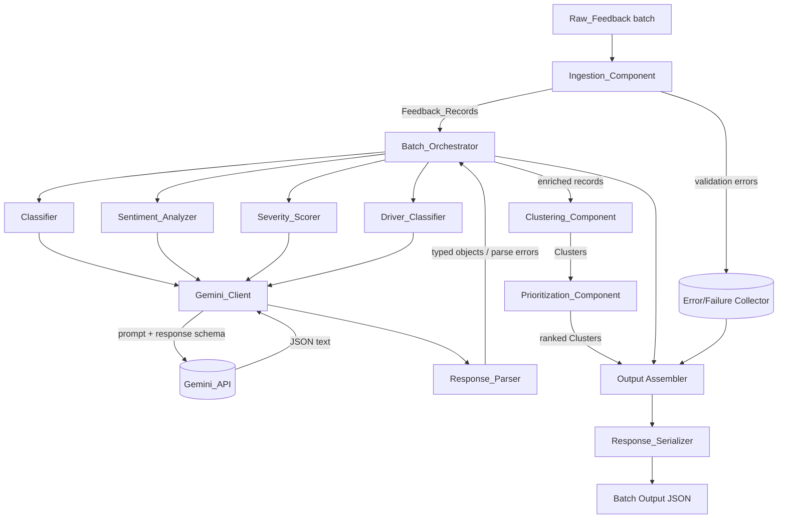
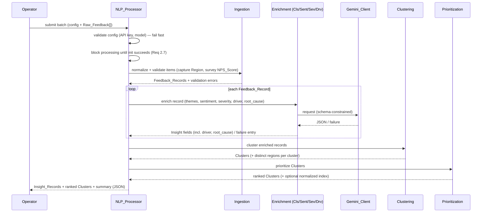
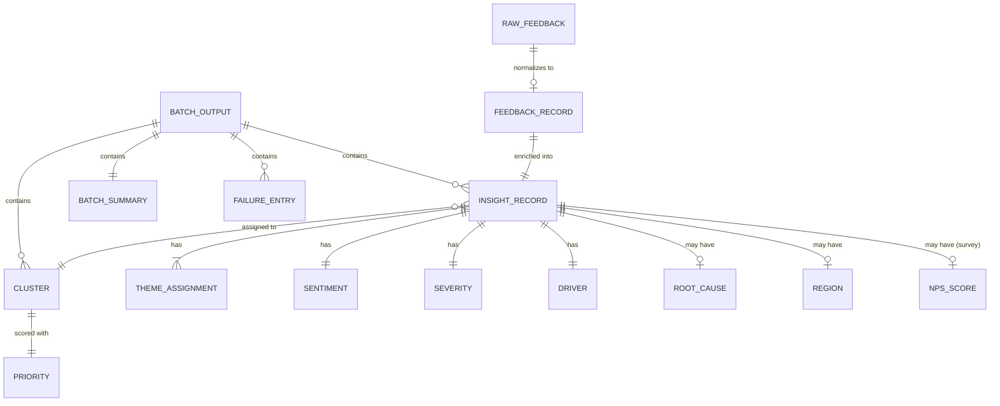

# Design Document

## Overview

The NLP Feedback Processing feature is the enrichment layer of a telecom Customer Feedback and Support Intake system. It accepts normalized customer feedback from four source channels (email, survey, call transcript, social post) and produces structured, ranked insights using the Google Gemini API.

The processing flow is a pipeline:

1. **Ingestion** normalizes and validates raw feedback into `Feedback_Record`s, capturing optional `Region` metadata and (for survey channel only) an optional `NPS_Score`.
2. **Gemini enrichment** (classification, sentiment, severity, driver, and root-cause capture) calls the Gemini API per record, with resilient retry/backoff and strict JSON-schema parsing.
3. **Clustering** groups semantically similar records into mutually exclusive clusters, recording the set of distinct regions present in each cluster.
4. **Prioritization** computes a deterministic, monotonic priority score per cluster and ranks them, optionally recording an additive normalized priority index when a per-region subscriber base is configured.
5. **Batch orchestration** assembles per-record `Insight_Record`s plus a batch summary and emits schema-conforming JSON.

Each `Insight_Record` carries, in addition to themes/sentiment/severity, a single `Driver` (the responsible entity/source) with a confidence, an optional free-text `Root_Cause`, an optional `Region`, and an optional survey `NPS_Score`, so downstream teams can analyze responsibility, root cause, and regional concentration.

Accuracy and output quality are the top priorities, so parsing/serialization correctness, schema enforcement on Gemini output, confidence-based review flagging, and deterministic prioritization are treated as first-class concerns.

### Technology Choices

- **Language: Python 3.11+.** Python is the strongest default for NLP/Gemini work and has first-class SDK and property-testing support. (The operator has not finalized the language; this design assumes Python and notes where the choice matters.)
- **Gemini SDK: `google-genai`** (the current Google Gen AI Python SDK). The client requests structured JSON output via response schema / response MIME type so the model returns parseable JSON.
- **Data modeling/validation: `pydantic` v2** for typed models, schema generation, and range validation.
- **Property-based testing: `Hypothesis`** to validate round-trip and monotonicity properties already specified in the requirements.
- **HTTP resilience:** backoff implemented around the SDK calls (custom exponential backoff to meet the exact 1s→60s, max-attempts 1–10 spec), since the requirement bounds are precise.

### Design Principles

- **Per-record isolation:** a failure enriching one record never aborts the batch (Req 3.4, 3.6, 10.2).
- **Strict schema boundaries:** Gemini output is untrusted text; it is validated against a schema before becoming an `Insight_Record` (Req 4.2, 5.6, 6.5, 7.4, 12.6, 12.7, 13.2).
- **Determinism where it matters:** prioritization is a pure deterministic function of cluster contents, independent of any configured subscriber base (Req 9.1, 9.11).
- **Fail-closed startup:** all record processing is blocked until initialization completes successfully with a valid API key and model name (Req 2.7).
- **Secret hygiene:** the API key never appears in logs or error messages (Req 2.6).

## Architecture

### High-Level Component Diagram



### Layering

The system separates three concerns so each can be tested independently:

- **Transport layer** — `Gemini_Client` only: authentication, request construction, timeout, retry/backoff. Knows nothing about themes or sentiment.
- **Enrichment layer** — `Classifier`, `Sentiment_Analyzer`, `Severity_Scorer`, `Driver_Classifier`: build prompts + response schemas, call the client, hand raw JSON to the `Response_Parser`, and apply business rules (defaults, validation, review flags). Root_Cause capture is handled in this layer alongside driver classification, since both come from the same enrichment response.
- **Aggregation layer** — `Clustering_Component`, `Prioritization_Component`, output assembly: pure-logic operations over already-enriched records, fully testable without the network.

This separation lets the aggregation and parsing layers run under property-based tests with no live API, while the transport layer is covered by mock-based and integration tests.

### Processing Sequence (per batch)



### Configuration and Startup

At startup the `NLP_Processor` validates configuration before any record is processed, and **blocks all record processing until initialization completes successfully** with a valid API key and model name (Req 2.2, 2.4, 2.7):

- `api_key` — required, non-empty, non-whitespace; otherwise stop with a configuration error.
- `model_name` — required, non-empty, non-whitespace; otherwise stop with a configuration error.
- `max_attempts` — integer 1–10, default 5.
- `request_timeout_seconds` — 1–120, default 30.
- `similarity_threshold` — 0.0–1.0 (clustering).
- `review_threshold` — 0.0–1.0, default 0.70.
- `theme_set` — configurable, defaults to the eleven standard themes (`billing`, `network_speed`, `outage`, `support_experience`, `device_hardware`, `pricing`, `voluntary_disconnect`, `field_maintenance`, `move_transfer`, `account_management`, `other`). The active set is read at startup so an operator can add/remove members without code changes (Req 5.2, 5.3).
- `driver_set` — configurable, defaults to the six standard drivers (`employee_driven`, `customer_driven`, `system_technology`, `business_rule_dispute`, `process_gap`, `other`). Read at startup so an operator can add/remove members without modifying the `Driver_Classifier` (Req 12.2, 12.3).
- `subscriber_base_by_region` — *optional* map of `Region → subscriber/population count`. When present, the `Prioritization_Component` additionally computes a normalized priority index (Req 9.9); when absent, no index is computed and prioritization behavior is unchanged (Req 9.10, 9.11).

Initialization is fail-closed: if any required value is missing/invalid the processor refuses to start and no `Feedback_Record` is processed. The API key is held in memory only and is redacted from every log line and error message.

## Components and Interfaces

Interfaces below use Python type-hint style for clarity. Each enrichment component depends on `Gemini_Client` and `Response_Parser` but not on each other.

### Ingestion_Component

Responsible for normalization and validation (Req 1).

```python
class IngestionComponent:
    def ingest_batch(self, raw_items: list[RawFeedback]) -> IngestionResult:
        """Assign a unique id to every item (including rejects), validate,
        and produce Feedback_Records for valid items only."""
```

Rules:
- Reject the whole batch if `len(raw_items) > 1000` with a batch-size validation error (Req 1.6); no items processed.
- Assign a unique identifier to every item up front, including ones that will be rejected (Req 1.5). IDs are unique across all records the component ever produces (UUIDv4, or a monotonic counter namespaced per processor instance).
- Trim only leading/trailing whitespace (space, tab, CR, LF); preserve interior characters exactly (Req 1.2).
- Reject items whose text is empty/whitespace-only after trim (Req 1.3), whose `source_channel` is outside the allowed set (Req 1.4), or whose cleaned text exceeds 10,000 characters (Req 1.7) — each produces a validation error keyed by the assigned id and no `Feedback_Record`.
- Copy original metadata onto the `Feedback_Record` unchanged (Req 1.1).
- **Region (optional):** if the metadata supplies a region/market identifier, store it as `region` on the `Feedback_Record` (Req 1.8); if absent, produce the record with `region` absent and do not reject on that basis (Req 1.9).
- **NPS_Score (survey-only, optional):** capture `nps_score` *only* when `source_channel == "survey"` and the metadata supplies an NPS value, storing it as an integer in 0..10 (Req 1.10, 15.1, 15.2). A survey NPS value that is non-integer or outside 0..10 → reject the item with a validation error keyed by the assigned id (Req 1.11, 15.4). **Absent NPS on the produced record (any cause):** whenever the produced `Feedback_Record` ends up with no `nps_score` present — including when the metadata supplies no NPS value, and including the non-survey-drop case below — the record is produced with `nps_score` absent and is **never** rejected on the basis of the absent NPS (Req 1.12). An NPS value supplied on a **non-survey** channel → drop it (record produced with `nps_score` absent, which is one of the absent-NPS cases above) and record a non-survey-nps note keyed by the assigned id (Req 15.3).

### Gemini_Client

The only component that touches the network (Req 2, 3).

```python
class GeminiClient:
    def __init__(self, api_key: str, model_name: str,
                 max_attempts: int = 5, timeout_s: int = 30): ...

    def generate(self, request: GeminiRequest) -> GeminiResult:
        """Send a schema-constrained request; apply timeout, retry/backoff.
        Returns raw response text on success or a typed failure."""
```

Behavior:
- Attaches the API key as the auth credential on every request (Req 2.1); uses the configured model name on every request (Req 2.3); instructs the API to return JSON matching the response schema (Req 4.1, 11.1).
- **Retryable:** rate-limit (HTTP 429) and transient server/network errors (5xx, connection failures) → exponential backoff, initial delay 1s doubling each attempt, capped at 60s per attempt, up to `max_attempts` (Req 3.1, 3.2). Retries resend identical content (Req 3.5).
- **Non-retryable:** authentication errors (HTTP 401/403) → report auth failure, no retry, fail the operation (Req 2.5).
- **Timeout:** abort and discard partial response if a request exceeds `timeout_s`; record a timeout error identifying the record (Req 3.3). If recording the timeout error itself fails, log the timeout to an alternative log destination and continue processing remaining records without aborting the batch (Req 3.7).
- **Failure recording:** if a request fails for *any* reason — whether or not a retry was attempted — record a failure result for the associated record with an error indication describing the cause (Req 3.6). This is broader than retry exhaustion: a single non-retryable failure, a timeout, or an immediate error all produce a failure result.
- **Exhaustion:** if all retry attempts fail, return a failure result for that record and let the orchestrator continue (Req 3.4).
- Redacts the API key from all logs/errors (Req 2.6).

Backoff delay for attempt `n` (1-indexed): `min(60, 1 * 2**(n-1))` seconds, optionally with jitter.

### Response_Parser

Validates and maps untrusted Gemini JSON to typed objects (Req 4.1, 4.2).

```python
class ResponseParser:
    def parse_enrichment(self, raw_json: str, record_id: str,
                         schema: type[BaseModel]) -> ParseOutcome:
        """Parse + schema-validate. On any violation, return a parse error
        and produce no partial object."""
```

Rules:
- Parse JSON; validate every required field, type, and range against the pydantic schema.
- On invalid JSON, missing required field, or out-of-range/wrong-type value → record a parse error keyed by `record_id`; write no field and produce no partial `Insight_Record` (Req 4.2). Parsing is all-or-nothing.

### Response_Serializer

Emits canonical JSON for storage/downstream (Req 4.3, 4.4).

```python
class ResponseSerializer:
    def serialize_insight(self, insight: InsightRecord) -> SerializeOutcome: ...
    def serialize_batch(self, output: BatchOutput) -> str: ...
```

Rules:
- Serialize only schema-valid, complete `Insight_Record`s (Req 4.3). Invalid/incomplete records → serialization error keyed by record id, no output for that record (Req 4.4).
- Produces **canonical JSON**: keys sorted lexicographically, insignificant whitespace removed, stable number formatting — this is what makes the JSON round-trip property (Req 4.6) byte-for-byte checkable.

### Classifier

Theme assignment (Req 5).

```python
class Classifier:
    def classify(self, record: FeedbackRecord) -> ClassificationOutcome: ...
```

Rules:
- Assigns at least one theme from the configured set (Req 5.1, 5.2), each with a confidence in [0.0, 1.0] (Req 5.4). The default configured set has eleven members: `billing`, `network_speed`, `outage`, `support_experience`, `device_hardware`, `pricing`, `voluntary_disconnect`, `field_maintenance`, `move_transfer`, `account_management`, `other` (Req 5.2). The active set is read from configuration at startup (Req 5.3).
- Assigns all themes with confidence ≥ 0.5 (Req 5.5).
- If no theme qualifies (none ≥ 0.5, or model says none apply) → assign `other` (Req 5.6).
- If the model returns a theme outside the configured set → discard it and assign `other` (Req 5.7).
- On API unavailable, **any** Gemini request timeout for the record regardless of the elapsed duration (not only the 30s case), or no response within 30s → leave record unclassified, preserve it unchanged, attach a classification-failure error indication (Req 5.8).
- If one or more themes reach confidence ≥ 0.5 but the processor fails to assign them to the record, mark the record failed and record a failure entry identifying it (Req 5.9). This is a system/assignment fault distinct from "no theme qualified": the qualifying themes existed but could not be persisted.

### Sentiment_Analyzer

Polarity assignment (Req 6).

```python
class SentimentAnalyzer:
    def analyze(self, record: FeedbackRecord) -> SentimentOutcome: ...
```

Rules:
- Assigns exactly one of `positive | neutral | negative` with a confidence in [0.0, 1.0] (Req 6.1, 6.2), recorded on the insight regardless of confidence value (Req 6.3).
- If any condition prevents assigning a sentiment from the Gemini output — a timeout, a malformed response, or an omitted value → default `neutral` and record a missing-sentiment note keyed by record id (Req 6.4).
- If a produced value is outside the set or confidence outside [0.0, 1.0] → reject the record, produce no `Insight_Record`, record a sentiment-validation error (Req 6.5). **Validation takes precedence over the default-neutral fallback:** when a response yields an invalid sentiment value or out-of-range confidence, the record is rejected even if a timeout or other failure condition (Req 6.4) also applies to the same response — the rejection path wins and no `Insight_Record` is produced.

### Severity_Scorer

Operational impact scoring (Req 7).

```python
class SeverityScorer:
    def score(self, record: FeedbackRecord) -> SeverityOutcome: ...
```

Rules:
- Assigns exactly one integer 1–5 (Req 7.1) plus at least one contributing factor, each 1–500 chars (Req 7.2).
- **Severity error precedence (exactly one path triggers, evaluated in this order):**
  1. **Invalid severity** — a produced value that is non-integer or outside 1–5 → reject the record, produce no `Insight_Record`, record a severity-range error (Req 7.4). This is evaluated **before** missing severity, so a response simultaneously interpretable as missing **and** invalid is treated as invalid severity (reject, no `Insight_Record`).
  2. **Missing severity** — the value is completely omitted and no value violating the 1–5 range is present → default 1 and record a missing-severity note (Req 7.3).
  3. **Timeout** — no response within 30s and the response is neither missing nor invalid → default 1 and record a severity-unavailable note (Req 7.5).

### Driver_Classifier

Driver (responsible entity/source) assignment (Req 12). Like the other enrichment components it depends on `Gemini_Client` and `Response_Parser` but not on the other enrichers.

```python
class DriverClassifier:
    def classify(self, record: FeedbackRecord) -> DriverOutcome: ...
```

Rules:
- Assigns **exactly one** driver from the configured set, with a confidence in [0.0, 1.0]; both the driver value and its confidence are recorded on the `Insight_Record` (Req 12.1, 12.4). The default configured set has six members: `employee_driven`, `customer_driven`, `system_technology`, `business_rule_dispute`, `process_gap`, `other` (Req 12.2). The active set is read from configuration at startup so members can change without code edits (Req 12.3).
- If the model omits a driver, indicates none apply, **or returns a driver value that exists but is not in the configured set** → treat all three as "no configured Driver applies": assign `other` and record a missing-driver note keyed by record id (Req 12.5, 12.6). An out-of-configured-set value is thus handled consistently with the omitted/none-apply cases — it is discarded, mapped to `other`, and noted.
- If the produced confidence is outside [0.0, 1.0] → reject the record, produce no `Insight_Record`, and record a driver-validation error keyed by the record id (Req 12.7).

### Root_Cause Capture

Captured from the same enrichment response, applied during assembly of the `Insight_Record` (Req 13). Root_Cause is an optional free-text field.

Rules:
- If the response provides a root cause of 1..500 characters → record it as `root_cause` on the `Insight_Record` (Req 13.1).
- If the provided root cause exceeds 500 characters → reject the record, produce no `Insight_Record`, and record **both** a missing-root-cause note and a root-cause-length error keyed by the record id (Req 13.2).
- If the response omits a root cause → produce the `Insight_Record` with `root_cause` absent, record a missing-root-cause note, and do **not** fail the record (Req 13.3).

### Clustering_Component

Groups similar records (Req 8).

```python
class ClusteringComponent:
    def cluster(self, records: list[EnrichedRecord],
                threshold: float) -> list[Cluster]: ...
```

Rules:
- Partitions input into mutually exclusive clusters; every input record is in exactly one cluster (Req 8.1, 8.4).
- Each cluster gets a non-empty representative label ≤ 120 chars derived from member text (Req 8.2).
- Records whose similarity **strictly exceeds** the threshold land in the same cluster (Req 8.3); a record whose similarity to every other record does **not** strictly exceed the threshold becomes a singleton cluster (Req 8.5). Similarity **exactly equal** to the threshold does **not** force co-clustering — such records become singletons unless some other record strictly exceeds the threshold with them.
- Empty input → zero clusters, but still produce clustering output (Req 8.6).
- Records each cluster's set of **distinct `Region` values** present among its member records (regions absent on members contribute nothing); this set is recorded on the `Cluster` (Req 14.3).
- Similarity uses Gemini text embeddings (cosine similarity) with agglomerative grouping at the configured threshold; falls back to a deterministic local embedding when embeddings are unavailable so clustering never aborts the batch.
- **Merge post-processing** (Req 8.7) may merge clusters containing similar records, but MUST preserve the same strict-exceeds invariant: after merging, every pair of records whose similarity **strictly exceeds** the threshold remains in the same cluster, and equality-at-threshold never forces a merge.

### Prioritization_Component

Ranks clusters (Req 9).

```python
class PrioritizationComponent:
    def prioritize(self, clusters: list[Cluster]) -> list[Cluster]:
        """Compute a deterministic, non-negative, monotonic priority score
        per cluster and return clusters in ranked order."""
```

Scoring function (pure, deterministic — Req 9.1):

```
priority(cluster) = max(0,
      w_sev  * sum(severity_scores)
    + w_vol  * count(records)
    + w_neg  * count(negative_sentiments))
```

with positive weights `w_sev, w_vol, w_neg > 0`. This construction guarantees monotonicity in each factor (Req 9.6, 9.7, 9.8) and non-negativity (Req 9.4). Identical inputs yield identical scores (Req 9.1).

Ordering (Req 9.2, 9.3): descending priority; ties broken by higher record count first; remaining ties by ascending cluster label. Two clusters **may** carry identical labels; when the label tie-break does not disambiguate (equal score, equal count, equal label), the component preserves their existing relative order deterministically via a **stable sort**. The score is recorded on each cluster (Req 9.5).

#### Optional Normalized Priority Index (additive — Req 9.9–9.11)

WHEN, and only when, a per-region subscriber base map (`subscriber_base_by_region`) is configured, the component **additionally** computes a normalized priority index per cluster:

```
predominant_region(cluster) = the Region most frequent among the cluster's member records
normalized_index(cluster)   = (count(records) / subscriber_base[predominant_region]) * 1_000_000
```

This index is recorded as a **separate additional field** on the cluster (`normalized_priority_index`). It is purely additive and reporting-only:

- The deterministic `Priority_Score`, the cluster ordering, and the tie-breaking are derived **solely** from severity totals, record counts, and sentiment values, and are **never** affected by the presence/absence of the subscriber base map (Req 9.11). The normalized index is **not** an input to ordering.
- If no subscriber base map is configured, no index is computed and `normalized_priority_index` is absent; `Priority_Score`, ordering, and tie-breaking are unchanged (Req 9.10).
- If the predominant region has no entry in the map (or the cluster has no region), the index is left absent for that cluster while the rest of prioritization proceeds normally.

### Batch_Orchestrator (NLP_Processor)

Drives the pipeline and assembles output (Req 10, 11).

```python
class NLPProcessor:
    def process_batch(self, raw_items: list[RawFeedback]) -> BatchOutput: ...
```

Rules:
- Validate batch size: empty or > 10,000 → no insights, batch-validation error noting the violated bound (Req 10.5).
- A record is *successful* only if classification, sentiment, severity, driver classification, and cluster assignment all complete without error (Req 10.1, 12.1); otherwise it is excluded and a failure entry `(id, reason)` is recorded (Req 10.2). Assignment faults also fail the record: qualifying themes (≥0.5) that cannot be assigned (Req 5.9), an out-of-range driver confidence (Req 12.7), or a root cause over 500 chars (Req 13.2) each produce a failure entry and no insight.
- Always produce an output even when zero insights succeed (Req 10.1).
- Surface optional dimensions on each insight: `driver` + driver confidence (Req 12.4), `root_cause` when present (Req 13.1), `region` when present (Req 14.1, 14.4), and `nps_score` when present (Req 14.2). If an `nps_score` carried on a `Feedback_Record` is non-integer or outside 0..10 at surfacing time, **clamp it to the nearest bound (0 or 10)** and still produce the `Insight_Record` — do not fail the record (Req 14.2). Absent `region`/`root_cause`/`nps_score` never fail the record (Req 13.3, 14.5).
- Summary: `submitted = successes + failures` (Req 10.3); emit assembled output as schema-conforming JSON (Req 10.4).
- Set a review flag on any insight with a theme/sentiment confidence below `review_threshold` (default 0.70) (Req 11.2); if a below-threshold score is detected but flagging fails, record a system error and retain the insight unflagged (Req 11.3).
- Record the Gemini model name on every insight (Req 11.4).
- If a ground-truth labeled dataset is supplied, compute classification accuracy as the proportion of evaluated records whose assigned themes exactly match the labeled themes, in [0.0, 1.0] (Req 11.5), and report it in the batch output (Req 11.6). If no ground-truth dataset is supplied, **omit** `classification_accuracy` from the output entirely — do not emit a default `0.0` (Req 11.7).

## Data Models

### Entity Relationship



### Core Types

```python
SourceChannel = Literal["email", "survey", "call_transcript", "social_post"]
ThemeLabel    = Literal["billing", "network_speed", "outage",
                        "support_experience", "device_hardware",
                        "pricing", "voluntary_disconnect", "field_maintenance",
                        "move_transfer", "account_management", "other"]
DriverLabel   = Literal["employee_driven", "customer_driven",
                        "system_technology", "business_rule_dispute",
                        "process_gap", "other"]
SentimentValue = Literal["positive", "neutral", "negative"]

# NOTE: ThemeLabel and DriverLabel show the *default* configured members.
# Both sets are read from configuration at startup (theme_set / driver_set),
# so the literals are the defaults rather than a hard-coded closed set.

class RawFeedback(BaseModel):
    source_channel: str           # validated against SourceChannel
    text: str
    metadata: dict[str, Any] = {} # may carry region and (survey-only) nps

class FeedbackRecord(BaseModel):
    id: str                       # unique across all produced records
    source_channel: SourceChannel
    cleaned_text: str             # trimmed; 1..10000 chars
    metadata: dict[str, Any]      # copied unchanged from RawFeedback
    region: str | None = None     # optional region/market (Req 1.8, 1.9)
    nps_score: int | None = None  # 0..10, survey channel only (Req 1.10-1.12)

class ThemeAssignment(BaseModel):
    theme: ThemeLabel
    confidence: float             # 0.0..1.0

class DriverAssignment(BaseModel):
    driver: DriverLabel
    confidence: float             # 0.0..1.0

class SeverityFactor(BaseModel):
    description: str              # 1..500 chars

class InsightRecord(BaseModel):
    feedback_id: str
    themes: list[ThemeAssignment]          # >= 1
    sentiment: SentimentValue
    sentiment_confidence: float            # 0.0..1.0
    severity_score: int                    # 1..5
    severity_factors: list[SeverityFactor] # >= 1
    driver: DriverAssignment               # exactly one (Req 12.1, 12.4)
    root_cause: str | None = None          # 1..500 chars when present (Req 13)
    region: str | None = None              # surfaced when present (Req 14.1)
    nps_score: int | None = None           # 0..10, survey-only; clamped to nearest bound at surfacing (Req 14.2)
    cluster_id: str
    review_flag: bool = False
    model_name: str
    notes: list[str] = []                  # missing-* / unavailable / non-survey-nps notes

class Cluster(BaseModel):
    cluster_id: str
    label: str                    # non-empty, <= 120 chars
    member_ids: list[str]         # feedback ids
    priority_score: float         # >= 0.0
    regions: list[str] = []       # distinct regions among members (Req 14.3)
    normalized_priority_index: float | None = None  # additive, only when subscriber base configured (Req 9.9-9.11)

class FailureEntry(BaseModel):
    feedback_id: str
    stage: Literal["ingestion","classification","sentiment",
                   "severity","driver","root_cause","parsing",
                   "serialization","clustering"]
    reason: str

class BatchSummary(BaseModel):
    submitted: int
    successful: int
    failures: int                 # successful + failures == submitted

class BatchOutput(BaseModel):
    insights: list[InsightRecord]
    clusters: list[Cluster]       # ranked, descending priority
    failures: list[FailureEntry]
    summary: BatchSummary
    model_name: str
    classification_accuracy: float | None = None  # present iff ground-truth given; omitted otherwise (Req 11.7)
```

### Gemini Enrichment Response Schema (per record)

The `Gemini_Client` instructs the API to return this JSON shape (Req 4.1, 11.1). The `Response_Parser` validates it strictly.

```json
{
  "type": "object",
  "required": ["themes", "sentiment", "sentiment_confidence",
               "severity_score", "severity_factors", "driver"],
  "additionalProperties": false,
  "properties": {
    "themes": {
      "type": "array",
      "minItems": 1,
      "items": {
        "type": "object",
        "required": ["theme", "confidence"],
        "properties": {
          "theme": {"type": "string"},
          "confidence": {"type": "number", "minimum": 0.0, "maximum": 1.0}
        }
      }
    },
    "sentiment": {"type": "string", "enum": ["positive","neutral","negative"]},
    "sentiment_confidence": {"type": "number", "minimum": 0.0, "maximum": 1.0},
    "severity_score": {"type": "integer", "minimum": 1, "maximum": 5},
    "severity_factors": {
      "type": "array", "minItems": 1,
      "items": {"type": "string", "minLength": 1, "maxLength": 500}
    },
    "driver": {
      "type": "object",
      "required": ["value", "confidence"],
      "properties": {
        "value": {"type": "string"},
        "confidence": {"type": "number", "minimum": 0.0, "maximum": 1.0}
      }
    },
    "root_cause": {"type": "string", "minLength": 1, "maxLength": 500}
  }
}
```

Notes on the new fields:
- `driver` is **required** in the schema, but the `Driver_Classifier` is tolerant by business rule: an omitted/empty driver, one indicating "none apply", or a value outside the configured set all map to `other` + missing-driver note (treated uniformly as "no configured Driver applies" — Req 12.5, 12.6). Only an out-of-range `confidence` rejects the record (Req 12.7). The schema enforces the confidence range so an out-of-range value surfaces as a parse/validation error.
- `root_cause` is **optional**. When present it must be 1..500 chars (the schema upper-bounds it; a value over 500 chars rejects the record per Req 13.2). When omitted, the record is still produced with a missing-root-cause note (Req 13.3).
- `region` and `nps_score` are **not** part of the enrichment response — they originate from ingestion metadata, not from the model — so they are absent from this schema and carried through from the `Feedback_Record`.

### Published Output Schema (batch)

The serialized batch output conforms to a published JSON Schema mirroring `BatchOutput`: `insights[]`, `clusters[]` (ranked), `failures[]`, `summary`, `model_name`, and optional `classification_accuracy`. Each insight carries its `driver` (`{value, confidence}`), optional `root_cause`, optional `region`, and optional `nps_score`; each cluster carries its distinct `regions[]` and an optional `normalized_priority_index`. The optional fields (`root_cause`, `region`, `nps_score`, `normalized_priority_index`, `classification_accuracy`) are **omitted entirely when absent** rather than emitted as null/default — in particular `classification_accuracy` is omitted when no ground-truth dataset is supplied (Req 11.7). Serialization is canonical (lexicographically sorted keys, normalized whitespace and number formatting) so the JSON round-trip property holds byte-for-byte (Req 4.6).

## Correctness Properties

*A property is a characteristic or behavior that should hold true across all valid executions of a system — essentially, a formal statement about what the system should do. Properties serve as the bridge between human-readable specifications and machine-verifiable correctness guarantees.*

These properties are derived from the acceptance criteria via the prework analysis above. Each is universally quantified and intended to be implemented as a single property-based test (Hypothesis) running at least 100 iterations. Acceptance criteria that are wiring checks (mock-verified examples), boundary edge cases, or fault-injection paths are covered by example/integration tests in the Testing Strategy rather than as properties.

### Property 1: Ingestion preserves identity, channel, and metadata

*For any* valid `Raw_Feedback` item, the produced `Feedback_Record` carries the same `source_channel`, the same metadata unchanged, cleaned text within 1..10000 characters, and an identifier; across any batch, all assigned identifiers are unique.

**Validates: Requirements 1.1, 1.5**

### Property 2: Whitespace trimming preserves interior content

*For any* core string and any surrounding leading/trailing whitespace (space, tab, CR, LF), the cleaned text equals the core string with only outer whitespace removed and all characters between the first and last non-whitespace character preserved exactly.

**Validates: Requirements 1.2**

### Property 3: Invalid items are rejected with an error and no record

*For any* `Raw_Feedback` whose text is empty/whitespace-only, or whose `source_channel` is outside the allowed set, the item is rejected, no `Feedback_Record` is produced, and a validation error is recorded keyed by the item's assigned identifier.

**Validates: Requirements 1.3, 1.4**

### Property 4: API key never leaks

*For any* operation — including failing and error-producing ones — the configured API key value never appears in captured log output or in any reported error message.

**Validates: Requirements 2.6**

### Property 5: Retry backoff schedule is correct for retryable errors

*For any* retryable error category (rate-limit, transient server error, network failure) and any configured `max_attempts` in 1..10, the client makes exactly `max_attempts` attempts and the delay before attempt n equals `min(60, 2**(n-1))` seconds.

**Validates: Requirements 3.1, 3.2**

### Property 6: Retries resend identical content

*For any* request that is retried, every retry attempt sends content byte-for-byte identical to the original request.

**Validates: Requirements 3.5**

### Property 7: Per-record failures are isolated

*For any* batch in which an arbitrary subset of records' enrichment requests always fail, the batch completes without aborting: each failed record produces a failure entry and the remaining records still produce insights.

**Validates: Requirements 3.4**

### Property 8: Strict parsing rejects invalid responses with no partial output

*For any* Gemini response that is invalid JSON, omits a required field, or contains a field violating its type or range, the `Response_Parser` records a parse error keyed by the record id and produces no field of, and no partial, `Insight_Record`.

**Validates: Requirements 4.2**

### Property 9: Serializer rejects invalid insights

*For any* `Insight_Record` that is invalid or incomplete with respect to the published output schema, the `Response_Serializer` records a serialization error keyed by the record id and produces no output for that record.

**Validates: Requirements 4.4**

### Property 10: Insight serialization round-trip

*For any* valid `Insight_Record`, serializing it and then parsing the serialized JSON produces an `Insight_Record` whose themes and theme confidence scores, sentiment and sentiment confidence, severity score, driver and driver confidence, root cause, region, NPS score, and cluster assignment are equal to the original.

**Validates: Requirements 4.1, 4.3, 4.5**

### Property 11: JSON normalization round-trip

*For any* valid expected-schema JSON value, parsing it and then serializing the result produces JSON byte-for-byte equal to the original normalized JSON (keys in lexicographic order, insignificant whitespace removed).

**Validates: Requirements 4.6**

### Property 12: Classifier output is well-formed

*For any* `Feedback_Record` enriched with a successful classification response, the result has at least one theme, every assigned theme is a member of the configured theme set (whose default members are the eleven standard themes including `voluntary_disconnect`, `field_maintenance`, `move_transfer`, and `account_management`), and every assigned theme has a confidence in the inclusive range 0.0 to 1.0.

**Validates: Requirements 5.1, 5.2, 5.3, 5.4**

### Property 13: Theme threshold selection and default

*For any* set of candidate themes with confidences, the classifier assigns exactly those configured-set themes whose confidence is at least 0.5; if no configured theme reaches 0.5 (or the model indicates none apply), the classifier assigns exactly the theme `other`.

**Validates: Requirements 5.5, 5.6**

### Property 14: Unknown themes are discarded

*For any* classification response containing theme labels outside the configured set, those labels never appear in the assigned themes; if no valid configured theme qualifies after discarding, the theme `other` is assigned.

**Validates: Requirements 5.7**

### Property 15: Sentiment is well-formed and always recorded

*For any* `Feedback_Record` enriched with a valid sentiment response, exactly one sentiment value from {positive, neutral, negative} is assigned with a confidence in 0.0..1.0, and both the value and confidence are recorded on the `Insight_Record` regardless of the confidence magnitude.

**Validates: Requirements 6.1, 6.2, 6.3**

### Property 16: Any condition preventing sentiment defaults to neutral with a note

*For any* enrichment response in which any condition prevents assigning a sentiment value — a timeout, a malformed response, or an omitted value — the analyzer assigns `neutral` and records a missing-sentiment note on the `Insight_Record` identifying the affected record.

**Validates: Requirements 6.4**

### Property 17: Invalid sentiment is rejected, taking precedence over fallback

*For any* produced sentiment value outside {positive, neutral, negative} or confidence outside 0.0..1.0, the record is rejected, no `Insight_Record` is produced, and a sentiment-validation error is recorded keyed by the record id — and this rejection holds even when a timeout or other failure condition that would otherwise trigger the default-neutral fallback (Req 6.4) also applies to the same response.

**Validates: Requirements 6.5**

### Property 18: Severity is well-formed

*For any* `Feedback_Record` enriched with a valid severity response, exactly one integer severity in 1..5 is assigned together with at least one contributing factor whose length is in 1..500 characters.

**Validates: Requirements 7.1, 7.2**

### Property 19: Missing severity defaults to 1 with a note

*For any* enrichment response that omits a severity value and contains no value violating the 1..5 range, the scorer assigns severity 1 and records a missing-severity note identifying the affected record.

**Validates: Requirements 7.3**

### Property 20: Invalid severity is rejected and takes precedence over missing

*For any* produced severity value that is non-integer or outside 1..5, the record is rejected, no `Insight_Record` is produced, and a severity-range error is recorded keyed by the record id; and *for any* response that is simultaneously interpretable as missing and as invalid, invalid severity is evaluated first so the record is rejected (treated as invalid) rather than defaulted.

**Validates: Requirements 7.4**

### Property 21: Clustering is a covering partition

*For any* set of one or more `Feedback_Record`s, the output clusters are mutually exclusive and every input record appears in exactly one cluster, so the total count of clustered records equals the input count.

**Validates: Requirements 8.1, 8.4**

### Property 22: Cluster labels are bounded and non-empty

*For any* produced cluster, its representative label is non-empty and at most 120 characters.

**Validates: Requirements 8.2**

### Property 23: Similarity strictly governs cluster co-membership

*For any* pair of records whose semantic similarity **strictly exceeds** the configured threshold, both are assigned to the same cluster; *for any* record whose similarity to every other record does not strictly exceed the threshold (including similarity exactly equal to the threshold), it is assigned to a singleton cluster containing only itself; and this strict-exceeds invariant is preserved after any merge post-processing step (Req 8.7).

**Validates: Requirements 8.3, 8.5, 8.7**

### Property 24: Priority scoring is deterministic and non-negative

*For any* cluster, computing its `Priority_Score` is deterministic — identical cluster contents always yield an identical score — and the resulting score is always at least zero and recorded on the cluster.

**Validates: Requirements 9.1, 9.4, 9.5**

### Property 25: Priority ordering with tie-breakers and stable order for identical labels

*For any* non-empty list of clusters, the output is ordered by descending `Priority_Score`; clusters with equal scores are ordered by descending `Feedback_Record` count, and clusters with equal scores and counts are ordered by ascending cluster label; and *for any* two clusters that tie on score, count, and label (identical labels are permitted), their relative order in the output equals their relative order in the input (deterministic stable sort).

**Validates: Requirements 9.2, 9.3**

### Property 26: Priority is monotonic in each contributing factor

*For any* two clusters that are identical except that one has a strictly higher total of severity scores, a strictly higher count of records, or a strictly higher count of negative sentiments, that cluster's `Priority_Score` is greater than or equal to the other's.

**Validates: Requirements 9.6, 9.7, 9.8**

### Property 27: Batch accounting is conserved

*For any* batch of 1..10,000 records, the number of `Insight_Record`s equals the number of fully-successful records, every failed record is excluded from insights and appears exactly once as a failure entry with an identifier and reason, and the summary satisfies `submitted == successful + failures` with `successful == len(insights)`; an output is produced even when zero insights succeed.

**Validates: Requirements 10.1, 10.2, 10.3**

### Property 28: Batch output conforms to the published schema

*For any* completed batch, the assembled output serializes to JSON that conforms to the published output schema.

**Validates: Requirements 10.4**

### Property 29: Review flag reflects low confidence

*For any* `Insight_Record`, the review flag is set if and only if at least one theme or sentiment confidence is below the configured review threshold (default 0.70).

**Validates: Requirements 11.2**

### Property 30: Model name is recorded on every insight

*For any* produced `Insight_Record`, the recorded Gemini model name equals the configured model name.

**Validates: Requirements 11.4**

### Property 31: Classification accuracy computation and conditional reporting

*For any* batch, if a ground-truth labeled dataset is supplied the reported classification accuracy equals the proportion of evaluated records whose assigned themes exactly match the labeled themes and lies in the inclusive range 0.0 to 1.0; and the `classification_accuracy` field is present in the batch output exactly when a ground-truth dataset is supplied — when none is supplied the field is omitted entirely and no default value (such as 0.0) is reported.

**Validates: Requirements 11.5, 11.6, 11.7**

### Property 32: Driver output is well-formed

*For any* `Feedback_Record` enriched with a valid driver response, exactly one driver value from the configured driver set (whose default members are `employee_driven`, `customer_driven`, `system_technology`, `business_rule_dispute`, `process_gap`, `other`) is assigned, with a confidence in the inclusive range 0.0 to 1.0, and both the driver value and its confidence are recorded on the `Insight_Record`.

**Validates: Requirements 12.1, 12.2, 12.4**

### Property 33: Missing, none-apply, or unknown driver defaults to `other` with a note

*For any* enrichment response that omits a driver, indicates that no configured driver applies, or supplies a driver value outside the configured set, the classifier treats the case uniformly as "no configured Driver applies": it assigns exactly the driver `other` and records a missing-driver note identifying the affected record.

**Validates: Requirements 12.5, 12.6**

### Property 34: Invalid driver confidence is rejected

*For any* produced driver confidence outside the inclusive range 0.0 to 1.0, the record is rejected, no `Insight_Record` is produced, and a driver-validation error is recorded keyed by the record id.

**Validates: Requirements 12.7**

### Property 35: Root cause bounds and default behavior

*For any* enrichment response, if a root cause of 1 to 500 characters is provided it is recorded verbatim on the `Insight_Record`; if a root cause longer than 500 characters is provided the record is rejected with **both** a missing-root-cause note and a root-cause-length error and no `Insight_Record` is produced; and if the root cause is omitted the `Insight_Record` is still produced with the root cause absent and a missing-root-cause note recorded, without failing the record.

**Validates: Requirements 13.1, 13.2, 13.3**

### Property 36: NPS capture is survey-gated and range-validated

*For any* `Raw_Feedback` item, an NPS value is captured as an integer in 0..10 on the produced `Feedback_Record` only when the source channel is `survey` and the value is a valid integer in 0..10; a survey item whose NPS value is non-integer or outside 0..10 is rejected with a validation error and produces no record; a non-survey item carrying an NPS value produces a record with the NPS absent and a non-survey-nps note keyed by its assigned id; and whenever the produced record ends up with no NPS present for any reason — no NPS supplied, or the non-survey-drop case — the record is produced with the NPS absent and is never rejected on that basis.

**Validates: Requirements 1.10, 1.11, 1.12, 15.1, 15.2, 15.3, 15.4**

### Property 37: Region and NPS are surfaced on insights; out-of-range NPS is clamped, not failed

*For any* `Feedback_Record`, the produced `Insight_Record` carries the record's region when a region is present and its NPS score when present; an NPS score that is non-integer or outside 0..10 carried into surfacing is clamped to the nearest bound (0 or 10) and the `Insight_Record` is still produced rather than failed; and when the region or NPS is absent the `Insight_Record` is produced with that field absent and the record is not failed on that basis.

**Validates: Requirements 1.8, 1.9, 14.1, 14.2, 14.4, 14.5**

### Property 38: Cluster records the set of distinct member regions

*For any* produced cluster, the cluster's recorded regions equal exactly the set of distinct region values present among its member records (members without a region contribute no region).

**Validates: Requirements 14.3**

### Property 39: A failure result is recorded for any request failure

*For any* Gemini request that fails for any reason — a non-retryable error, an exhausted retry sequence, a timeout, or an immediate error, whether or not a retry was attempted — a failure result describing the cause is recorded for the associated record and the batch continues processing the remaining records.

**Validates: Requirements 3.6**

### Property 40: Normalized priority index is additive and never alters ordering

*For any* list of clusters, computing prioritization with a configured per-region subscriber base produces exactly the same `Priority_Score` for every cluster, the same cluster ordering, and the same tie-breaking outcome as computing it with no subscriber base configured; the only difference is that, when the base is configured, each cluster additionally carries a normalized priority index equal to its record volume divided by the configured subscriber base for its predominant region scaled to a per-1,000,000-subscriber basis, recorded as a separate field and never used as an ordering input.

**Validates: Requirements 9.9, 9.10, 9.11**

## Error Handling

Errors are classified by where they occur and whether they are fatal to the batch. The guiding principle is **fail fast on configuration, isolate per-record failures, never leak secrets.**

### Configuration Errors (fatal, pre-processing)

Raised at startup before any record is processed (Req 2.2, 2.4). The processor refuses to start, **blocks all record processing until initialization completes successfully** (Req 2.7), and reports which configuration value is missing/invalid. The API key is referenced by name only, never by value (Req 2.6).

| Condition | Behavior |
|---|---|
| API key absent/empty/whitespace | Stop init, configuration error identifying missing API key |
| Model name absent/empty/whitespace | Stop init, configuration error identifying missing model name |
| `max_attempts` outside 1..10, `timeout` outside 1..120, thresholds outside 0..1 | Stop init, configuration error identifying the invalid parameter |
| Init not yet completed successfully | Block/refuse all `Feedback_Record` processing until init succeeds (Req 2.7) |

### Batch-Level Errors (fatal to the batch)

| Condition | Behavior |
|---|---|
| Ingestion batch > 1000 raw items | Reject batch, process nothing, batch-size validation error (Req 1.6) |
| Processing batch empty or > 10,000 records | No insights, batch-validation error naming the violated bound (Req 10.5) |

### Per-Record Errors (isolated, non-fatal)

Each is recorded as a `FailureEntry(feedback_id, stage, reason)` (or a validation error keyed by the assigned id during ingestion); the batch continues (Req 3.4, 3.6, 10.2).

| Stage | Trigger | Behavior |
|---|---|---|
| Ingestion | empty/whitespace text, bad channel, text > 10,000 chars | Reject item, validation error keyed by id (Req 1.3, 1.4, 1.7) |
| Ingestion | survey NPS non-integer/out-of-range | Reject item, validation error keyed by id (Req 1.11, 15.4) |
| Transport | timeout exceeded | Abort, discard partial, timeout error keyed by id (Req 3.3) |
| Transport | any request failure (retryable exhausted, non-retryable, timeout, immediate) | Failure result keyed by id describing cause, continue batch (Req 3.4, 3.6) |
| Parsing | invalid JSON / missing field / out-of-range | Parse error keyed by id, no partial insight (Req 4.2) |
| Serialization | invalid/incomplete insight | Serialization error keyed by id, no output for it (Req 4.4) |
| Classification | API unavailable / any timeout (any duration) / >30s | Leave unclassified, preserve record, attach error (Req 5.8) |
| Classification | qualifying themes (≥0.5) cannot be assigned | Mark record failed, failure entry keyed by id (Req 5.9) |
| Sentiment | value/confidence out of range (precedence over default-neutral fallback, even on concurrent timeout/failure) | Reject record, sentiment-validation error (Req 6.5) |
| Severity | non-integer/out-of-range value (invalid; evaluated before missing, then timeout) | Reject record, severity-range error (Req 7.4) |
| Driver | confidence out of range | Reject record, driver-validation error keyed by id (Req 12.7) |
| Root cause | provided value > 500 chars | Reject record, record both a missing-root-cause note and a root-cause-length error keyed by id (Req 13.2) |

### Non-Fatal Degradations (recorded as notes, record still succeeds)

These attach a note to the `Insight_Record` and apply a safe default rather than failing the record:

- Any condition preventing sentiment assignment (timeout/malformed/omitted) → default `neutral` + missing-sentiment note, **unless** validation rejects the response (invalid value/out-of-range confidence), which takes precedence (Req 6.4, 6.5).
- Missing severity (omitted, no range-violating value) → default `1` + missing-severity note, applied only after invalid-severity check fails (Req 7.3, 7.4).
- Severity timeout (>30s, neither missing nor invalid) → default `1` + severity-unavailable note (Req 7.5).
- Missing/none-apply driver, or a value outside the configured set → all treated as "no configured Driver applies": default `other` + missing-driver note (Req 12.5, 12.6).
- Omitted root cause → root cause absent + missing-root-cause note (Req 13.3).
- Absent region → region absent, record not failed (Req 1.9, 14.5).
- Absent NPS on the produced record for any cause → NPS absent, record not failed (Req 1.12); non-survey NPS value → NPS dropped + non-survey-nps note (Req 15.3).
- Out-of-range/non-integer NPS carried into surfacing → clamped to nearest bound (0 or 10), `Insight_Record` still produced (Req 14.2).

### Alternative-Destination Logging (resilience)

If recording a timeout error for a record itself fails, the `Gemini_Client` logs the timeout to an alternative log destination and continues processing the remaining records without aborting the batch (Req 3.7). This guards against the error-recording path becoming a single point of failure.

### Authentication Errors (fatal to current operation, non-retryable)

Auth failures (401/403) are never retried; the client reports an authentication failure and the processor fails the current operation (Req 2.5). The key value is excluded from the message (Req 2.6).

### Secret Redaction

A logging filter and an error-formatting wrapper redact the configured API key from any string before it is written to logs or surfaced in an error. This is verified by Property 4.

## Testing Strategy

The feature is well-suited to property-based testing because its core is pure logic over structured data: normalization, schema parsing/serialization, theme/sentiment/severity rules, clustering partitions, and a deterministic prioritization function. PBT is applied to those layers; the network/transport and wiring concerns are covered by mock-based and integration tests.

### Property-Based Tests (Hypothesis)

- Implemented with **Hypothesis**; PBT is not implemented from scratch.
- Each of the 40 correctness properties maps to a **single** property-based test.
- Each test runs a **minimum of 100 iterations** (`@settings(max_examples=100)` or higher).
- Each test is tagged with a comment referencing its design property:
  - Format: **Feature: nlp-feedback-processing, Property {number}: {property_text}**
- Custom Hypothesis strategies generate the domain types:
  - `raw_feedback()` — random channels (valid and invalid), text with controllable surrounding whitespace and length (around the 10,000 boundary), arbitrary metadata, optional region values, and optional NPS values (valid 0..10, out-of-range/non-integer, and values carried for clamp-at-surfacing tests) on survey and non-survey channels.
  - `enrichment_response()` — valid and deliberately malformed Gemini JSON (bad syntax, dropped required fields, out-of-range values, unknown theme labels, omitted sentiment/severity, responses simultaneously interpretable as missing-and-invalid severity, sentiment invalidity concurrent with timeout/failure conditions, omitted/none-apply/unknown driver, out-of-range driver confidence, root cause of varying length including >500 and omitted).
  - `insight_record()` — valid insights (incl. driver, root_cause, region, nps_score) for round-trip; invalid/incomplete insights for rejection tests.
  - `cluster()` — clusters with controllable severity totals, record counts, negative-sentiment counts, and member region composition for monotonicity, ordering, region-set, and normalized-index tests.
  - `record_set_with_similarity()` — record sets with a controllable pairwise similarity matrix (including values exactly equal to the threshold) so strict-exceeds threshold co-membership and singleton behavior is deterministic.
  - `subscriber_base_map()` — optional per-region subscriber base maps for the normalized-index independence property.
- The Gemini API is **mocked** in property tests (a fake transport returns scripted/parametrized responses) so 100+ iterations are cheap and deterministic; the transport's retry/backoff and failure-recording logic is tested against a mock that records attempts, delays, and failure categories.

### Example-Based Unit Tests

For wiring, fault-injection, and specific behaviors that do not vary meaningfully with input:

- API key attached to each request; configured model used on each request (Req 2.1, 2.3).
- Auth error → no retry, operation fails (Req 2.5).
- Request timeout → abort, discard partial, timeout error keyed by id (Req 3.3).
- Classification unavailable/timeout → record preserved unchanged, error attached (Req 5.8).
- Qualifying themes (≥0.5) cannot be assigned → record marked failed + failure entry (Req 5.9, fault injection).
- Severity timeout → default 1 + severity-unavailable note (Req 7.5).
- Gemini request includes the response-schema instruction (Req 4.1, 11.1).
- Below-threshold detected but flag-set fails → system error, insight retained unflagged (Req 11.3, fault injection).
- Timeout-error recording itself fails → timeout logged to alternative destination, batch continues (Req 3.7, fault injection).

### Edge-Case / Boundary Tests

- Ingestion batch size at 1000 / 1001 (Req 1.6).
- Cleaned text length at 10000 / 10001 (Req 1.7).
- Missing/empty/whitespace API key and model name at startup (Req 2.2, 2.4).
- Processing batch size at 0 / 1 / 10000 / 10001 (Req 10.5).
- Empty clustering input → zero clusters, valid output (Req 8.6).
- Similarity exactly equal to the threshold → records become singletons, not co-clustered; strictly-above → co-clustered (Req 8.3, 8.5, 8.7).
- NPS carried into surfacing below 0 / above 10 / non-integer → clamped to nearest bound, insight still produced (Req 14.2).
- Processing blocked before successful initialization; proceeds only after valid config (Req 2.7, smoke).

### Integration / Smoke Tests

- A small live or recorded-response integration test that exercises one real enrichment round-trip against the Gemini API (run outside the fast unit suite, requires a real API key) to confirm the SDK wiring, response-schema request, and end-to-end parse.
- A startup smoke test confirming the processor initializes with valid configuration, refuses to start without it, and blocks all record processing until initialization succeeds (Req 2.7).

### Coverage Mapping

Every acceptance criterion maps to at least one test: PROPERTY-classified criteria to Properties 1–40; EXAMPLE-classified criteria to unit tests; EDGE_CASE-classified criteria to boundary tests; fault-injection criteria (5.9, 11.3, 3.7) to example tests; and setup/wiring criteria (2.7) to smoke tests. This ensures comprehensive, traceable coverage with property tests carrying the broad input coverage and unit/integration/smoke tests carrying the specific and external-dependency cases.
