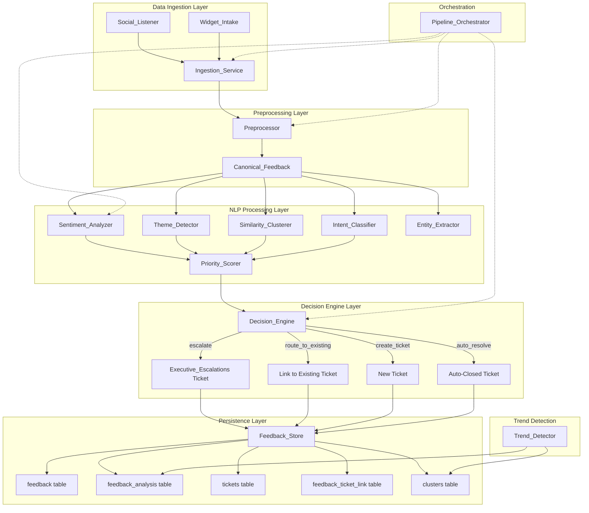
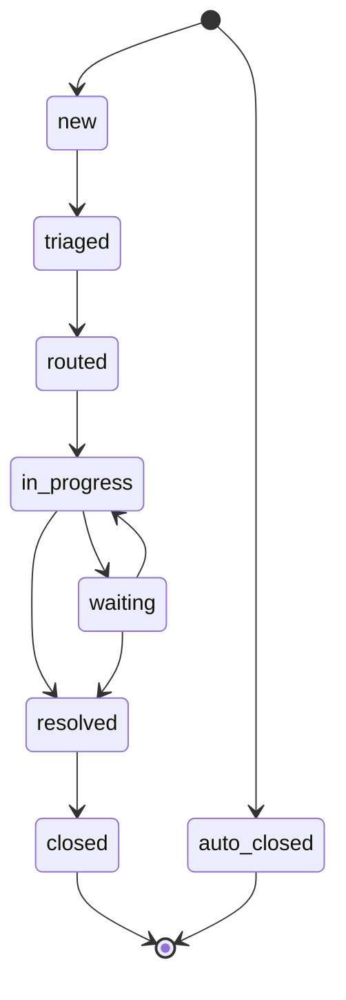
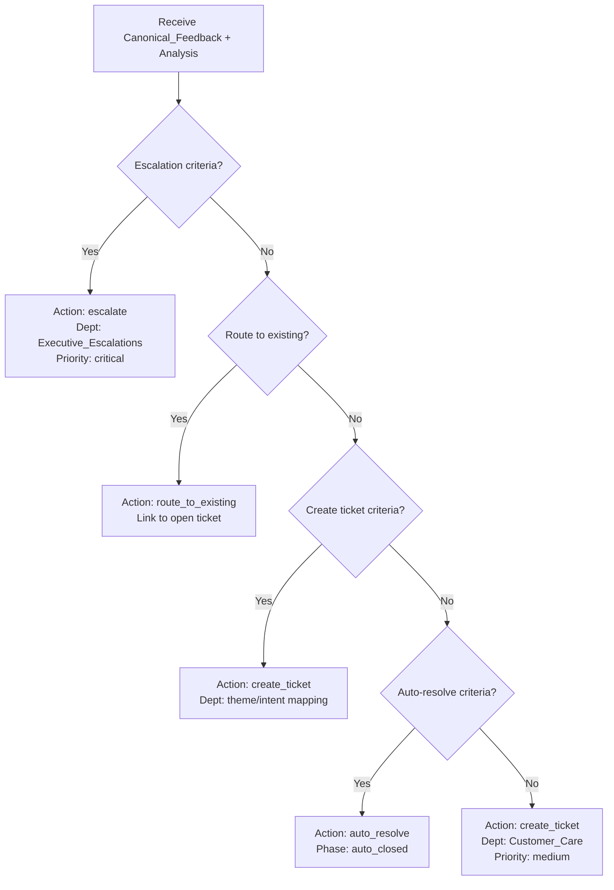

# Design Document: NLP Feedback Routing

## Overview

This design describes an NLP-powered customer feedback processing and routing system that ingests feedback from social media and direct widget channels, applies multi-stage NLP analysis, and routes feedback through a decision engine to tickets with full lifecycle tracking.

The system extends the existing `nlp_processing` package architecture (Pydantic models, Google Gemini transport, SQLite persistence, pipeline orchestrator pattern) with new components for:

- Dual-channel ingestion (Social_Listener + Widget_Intake)
- Text preprocessing with PII masking and deduplication
- Multi-dimensional NLP analysis (sentiment, theme, clustering, priority, intent, entity extraction)
- Rule-based decision engine with priority-ordered evaluation
- Relational database schema with ticket lifecycle management
- Trend detection and cluster lifecycle monitoring
- Deterministic JSON serialization with round-trip fidelity

The architecture follows a layered pipeline model where each stage produces structured output consumed by subsequent stages, with independent per-record failure isolation and retry semantics.

## Architecture



### Design Decisions

1. **Layered pipeline with per-record isolation**: Consistent with the existing `NLPProcessor.process_batch` pattern. Each record progresses independently; failures are captured as structured entries without blocking other records.

2. **SQLite with WAL mode**: The existing persistence store uses SQLite with WAL journaling. This design extends it with new tables for the relational schema. For production scale, a migration to PostgreSQL is straightforward since we use parameterized queries.

3. **Pydantic v2 models for all data structures**: Consistent with the existing `nlp_processing.models` package. Pydantic enforces field-level constraints (ranges, enums, string lengths) at construction time.

4. **Google Gemini API for NLP inference**: The existing transport layer (`GeminiClient`) provides retry logic, secret redaction, and lazy initialization. The new NLP components (sentiment, theme, intent, entity) use this same client.

5. **Decision engine as pure function**: The routing logic is a deterministic function of the NLP analysis output. No external calls are needed, making it highly testable with property-based tests.

6. **Canonical JSON serialization**: Extends the existing `ResponseSerializer` pattern with sorted keys, compact separators, and 6-decimal float precision for byte-for-byte round-trip fidelity.

## Components and Interfaces

### Ingestion_Service

Receives raw feedback from two channels and produces source-specific records.

```python
class SocialFeedback(BaseModel):
    feedback_id: str  # UUID
    source_type: Literal["social"]
    platform: Literal["reddit", "x", "facebook"]
    username_handle: str = Field(max_length=320)
    post_id: str
    message_text: str = Field(max_length=10_000)
    post_url: str | None = None
    created_at_original: str  # ISO 8601 UTC
    ingested_at: str  # ISO 8601 UTC
    language_code: str
    engagement_metrics: EngagementMetrics
    recency_score: float = Field(ge=0.0, le=1.0)
    location: str | None = None  # "City, CC"

class WidgetFeedback(BaseModel):
    feedback_id: str  # UUID
    source_type: Literal["widget"]
    submission_channel: Literal["app_widget", "website_form", "support_intake_form"]
    message_text: str = Field(min_length=1, max_length=10_000)
    created_at: str  # ISO 8601 UTC
    consent_to_contact: bool
    customer_id: str | None = None
    account_type: str | None = None
    selected_category: ThemeCategory | None = None
    location: str | None = Field(default=None, max_length=500)

class IngestionService:
    def ingest_social(self, post_data: dict) -> SocialFeedback | None
    def ingest_widget(self, submission: dict) -> WidgetFeedback | ValidationError
```

### Preprocessor

Transforms source-specific records into a unified schema.

```python
class CanonicalFeedback(BaseModel):
    feedback_id: str  # UUID
    source_type: Literal["social", "widget"]
    original_source_id: str
    cleaned_text: str = Field(min_length=1, max_length=10_000)
    detected_language: str  # ISO 639-1 or "und"
    ingested_at: str  # ISO 8601 UTC
    duplicate_count: int = Field(default=0, ge=0)
    profanity_detected: bool = False
    metadata: dict[str, Any] = Field(default_factory=dict)
    processing_status: ProcessingStatus = "ingested"

class Preprocessor:
    def preprocess(self, feedback: SocialFeedback | WidgetFeedback) -> CanonicalFeedback
    def clean_text(self, raw_text: str) -> str  # HTML strip, NFC normalize, whitespace collapse
    def detect_language(self, text: str) -> str  # ISO 639-1 code
    def mask_pii(self, text: str) -> tuple[str, str]  # (masked, original)
    def check_duplicate(self, cleaned_text: str, source_type: str, window_hours: int = 24) -> str | None
```

### NLP Pipeline Components

```python
class SentimentAnalyzer:
    def analyze(self, feedback: CanonicalFeedback) -> SentimentResult
    # Returns: sentiment_label, sentiment_score (-1.0 to +1.0)
    # Enforces label/score consistency: >0.2 positive, <-0.2 negative, else neutral

class ThemeDetector:
    def detect(self, feedback: CanonicalFeedback) -> ThemeResult
    # Returns: primary_theme, secondary_theme (nullable)
    # Confidence < 0.3 → "unclassified"

class SimilarityClusterer:
    def assign_cluster(self, feedback: CanonicalFeedback, analysis: FeedbackAnalysis) -> str
    # Returns cluster_id; creates new cluster if no match > 0.7
    # Weighted: text similarity + shared theme + geographic proximity (50km)

class PriorityScorer:
    def score(self, feedback: CanonicalFeedback, analysis: FeedbackAnalysis) -> PriorityResult
    # Returns: priority_level (low/medium/high/critical), priority_score (0.0-1.0)
    # Evaluates in descending precedence: critical > high > medium > low

class IntentClassifier:
    def classify(self, feedback: CanonicalFeedback) -> IntentResult
    # Returns: intent (from Intent_Type set), confidence, requires_action (bool)
    # Confidence <= 0.4 → "unclassified", requires_action = false

class EntityExtractor:
    def extract(self, feedback: CanonicalFeedback) -> list[ExtractedEntity]
    # Max 50 entities, confidence >= 0.5 threshold, entity_value max 200 chars
    # dollar_amount normalized to 2 decimal places
```

### Decision_Engine

Pure function that evaluates routing rules in priority order.

```python
class DecisionEngine:
    def evaluate(self, feedback: CanonicalFeedback, analysis: FeedbackAnalysis) -> RoutingDecision
    # Evaluation order: escalate → route_to_existing → create_ticket → auto_resolve
    # Returns: routing_action, ticket (created/linked), department, resolution_type

    def _check_escalation(self, feedback, analysis) -> bool
    def _check_route_to_existing(self, feedback, analysis) -> RoutingDecision | None
    def _check_create_ticket(self, feedback, analysis) -> RoutingDecision | None
    def _check_auto_resolve(self, feedback, analysis) -> RoutingDecision
```

### Pipeline_Orchestrator

Coordinates end-to-end processing with status tracking and retries.

```python
class PipelineOrchestrator:
    def process_feedback(self, feedback: SocialFeedback | WidgetFeedback) -> ProcessingResult
    # Stages: ingestion → preprocessing → NLP analysis → decision routing
    # Retries: 3 attempts, exponential backoff (5s, 10s, 20s, max 60s)
    # Timeout: 120 seconds total per record
    # Status tracking: ingested → preprocessing → preprocessed → analyzing → analyzed → routing → routed
```

### Feedback_Store

Relational persistence with constraint enforcement.

```python
class FeedbackStore:
    def insert_feedback(self, record: FeedbackRecord) -> None
    def insert_analysis(self, analysis: FeedbackAnalysis) -> None
    def insert_ticket(self, ticket: Ticket) -> None
    def link_feedback_ticket(self, feedback_id: str, ticket_id: str) -> None
    def insert_cluster(self, cluster: ClusterRecord) -> None
    def transition_ticket_phase(self, ticket_id: str, new_phase: TicketPhase, actor: str) -> None
    def update_cluster(self, cluster_id: str, volume_increment: int = 1) -> None
```

## Data Models

### Enumerations

```python
ThemeCategory = Literal[
    "outage", "billing", "speed_performance", "installation",
    "technician_visit", "support_experience", "app_usability",
    "equipment", "cancellation_retention"
]

IntentType = Literal[
    "complaint", "request_for_help", "outage_report", "billing_dispute",
    "feature_suggestion", "praise", "cancellation_risk", "unclassified"
]

TicketPhase = Literal[
    "new", "triaged", "routed", "in_progress", "waiting",
    "resolved", "closed", "auto_closed"
]

RoutingDepartment = Literal[
    "Network_Operations", "Billing_Support", "Technical_Support",
    "Field_Operations", "Digital_Product", "Customer_Care",
    "Retention", "Social_Media_Care", "Executive_Escalations"
]

RoutingAction = Literal["auto_resolve", "route_to_existing", "create_ticket", "escalate"]

ProcessingStatus = Literal[
    "ingested", "preprocessing", "preprocessed", "analyzing",
    "analyzed", "routing", "routed", "retrying", "failed"
]

ClusterStatus = Literal["active", "monitoring", "resolved"]

ResolutionType = Literal[
    "resolved_by_agent", "auto_resolved", "duplicate",
    "known_resolved", "no_action_required", "faq_matched"
]
```

### Database Schema

```sql
-- Feedback table (Requirement 17)
CREATE TABLE feedback (
    feedback_id TEXT PRIMARY KEY NOT NULL,
    source_type TEXT NOT NULL CHECK (source_type IN ('social', 'widget')),
    platform TEXT CHECK (length(platform) <= 50),
    message_text TEXT NOT NULL CHECK (length(trim(message_text)) >= 1 AND length(message_text) <= 10000),
    customer_id TEXT CHECK (length(customer_id) <= 100),
    created_at_original TEXT NOT NULL,
    ingested_at TEXT NOT NULL DEFAULT (strftime('%Y-%m-%dT%H:%M:%SZ', 'now')),
    recency_score REAL CHECK (recency_score IS NULL OR (recency_score >= 0.0 AND recency_score <= 1.0)),
    channel_metadata TEXT,  -- JSON
    processing_status TEXT NOT NULL DEFAULT 'ingested'
        CHECK (processing_status IN ('ingested','preprocessing','preprocessed','analyzing','analyzed','routing','routed','retrying','failed')),
    routing_action TEXT CHECK (length(routing_action) <= 50)
);
CREATE INDEX idx_feedback_ingested_at ON feedback(ingested_at);

-- Feedback Analysis table (Requirement 18)
CREATE TABLE feedback_analysis (
    feedback_id TEXT PRIMARY KEY NOT NULL REFERENCES feedback(feedback_id),
    sentiment_label TEXT NOT NULL CHECK (sentiment_label IN ('positive', 'neutral', 'negative')),
    sentiment_score REAL NOT NULL CHECK (sentiment_score >= -1.0 AND sentiment_score <= 1.0),
    priority_score REAL NOT NULL CHECK (priority_score >= 0.0 AND priority_score <= 1.0),
    priority_level TEXT NOT NULL CHECK (priority_level IN ('low', 'medium', 'high', 'critical')),
    theme_primary TEXT NOT NULL,
    theme_secondary TEXT,
    intent TEXT NOT NULL,
    cluster_id TEXT REFERENCES clusters(cluster_id),
    requires_action INTEGER NOT NULL,  -- boolean
    entities TEXT,  -- JSON
    processed_at TEXT NOT NULL
);
CREATE INDEX idx_feedback_analysis_processed_at ON feedback_analysis(processed_at);

-- Tickets table (Requirement 19)
CREATE TABLE tickets (
    ticket_id TEXT PRIMARY KEY NOT NULL,
    ticket_phase TEXT NOT NULL CHECK (ticket_phase IN ('new','triaged','routed','in_progress','waiting','resolved','closed','auto_closed')),
    priority_level TEXT NOT NULL CHECK (priority_level IN ('low', 'medium', 'high', 'critical')),
    assigned_department TEXT NOT NULL CHECK (assigned_department IN ('Network_Operations','Billing_Support','Technical_Support','Field_Operations','Digital_Product','Customer_Care','Retention','Social_Media_Care','Executive_Escalations')),
    created_at TEXT NOT NULL,
    updated_at TEXT NOT NULL,
    resolution_type TEXT CHECK (resolution_type IS NULL OR resolution_type IN ('resolved_by_agent','auto_resolved','duplicate','known_resolved','no_action_required','faq_matched')),
    resolution_notes TEXT CHECK (resolution_notes IS NULL OR length(resolution_notes) <= 2000),
    linked_cluster_id TEXT REFERENCES clusters(cluster_id)
);
CREATE INDEX idx_tickets_dept_phase ON tickets(assigned_department, ticket_phase);

-- Feedback-Ticket Link table (Requirement 20)
CREATE TABLE feedback_ticket_link (
    feedback_id TEXT NOT NULL UNIQUE REFERENCES feedback(feedback_id) ON DELETE CASCADE,
    ticket_id TEXT NOT NULL REFERENCES tickets(ticket_id) ON DELETE CASCADE
);

-- Clusters table (Requirement 21)
CREATE TABLE clusters (
    cluster_id TEXT PRIMARY KEY NOT NULL,
    theme TEXT NOT NULL CHECK (length(theme) <= 120),
    cluster_summary TEXT CHECK (length(cluster_summary) <= 500),
    volume_count INTEGER NOT NULL CHECK (volume_count >= 1) DEFAULT 1,
    sentiment_trend TEXT CHECK (sentiment_trend IS NULL OR length(sentiment_trend) <= 50),
    priority_level TEXT NOT NULL CHECK (priority_level IN ('low', 'medium', 'high', 'critical')),
    first_seen_at TEXT NOT NULL,
    last_seen_at TEXT NOT NULL,
    status TEXT NOT NULL CHECK (status IN ('active', 'monitoring', 'resolved')) DEFAULT 'active'
);
```

### Pydantic Models for NLP Output

```python
class FeedbackAnalysis(BaseModel):
    """Complete NLP analysis result for a single feedback record."""
    feedback_id: str
    sentiment_label: Literal["positive", "neutral", "negative"]
    sentiment_score: float = Field(ge=-1.0, le=1.0)
    priority_score: float = Field(ge=0.0, le=1.0)
    priority_level: Literal["low", "medium", "high", "critical"]
    theme_primary: str
    theme_secondary: str | None = None
    intent: str
    cluster_id: str | None = None
    requires_action: bool
    entities: list[ExtractedEntity] = Field(default_factory=list)
    processed_at: str  # ISO 8601 UTC

class ExtractedEntity(BaseModel):
    entity_type: Literal["service_area", "product_name", "time_reference",
                         "dollar_amount", "equipment_name", "outage_mention",
                         "competitor_mention"]
    entity_value: str = Field(max_length=200)
    confidence: float = Field(ge=0.5, le=1.0)

class Ticket(BaseModel):
    ticket_id: str  # UUID
    ticket_phase: TicketPhase
    priority_level: Literal["low", "medium", "high", "critical"]
    assigned_department: RoutingDepartment
    created_at: str  # ISO 8601 UTC
    updated_at: str  # ISO 8601 UTC
    resolution_type: ResolutionType | None = None
    resolution_notes: str | None = Field(default=None, max_length=2000)
    linked_cluster_id: str | None = None

class ClusterRecord(BaseModel):
    cluster_id: str  # UUID
    theme: str = Field(max_length=120)
    cluster_summary: str | None = Field(default=None, max_length=500)
    volume_count: int = Field(ge=1, default=1)
    sentiment_trend: str | None = Field(default=None, max_length=50)
    priority_level: Literal["low", "medium", "high", "critical"]
    first_seen_at: str  # ISO 8601 UTC
    last_seen_at: str  # ISO 8601 UTC
    status: ClusterStatus = "active"

class RoutingDecision(BaseModel):
    routing_action: RoutingAction
    ticket: Ticket | None = None
    linked_ticket_id: str | None = None  # for route_to_existing
    resolution_type: ResolutionType | None = None
    department: RoutingDepartment | None = None
    evaluation_timestamp: str  # ISO 8601 UTC
```

### Ticket Phase Transition Matrix



Valid transitions enforced by `FeedbackStore.transition_ticket_phase()`:

| Current Phase | Valid Next Phases |
|---|---|
| new | triaged |
| triaged | routed |
| routed | in_progress |
| in_progress | waiting, resolved |
| waiting | in_progress, resolved |
| resolved | closed |
| closed | (terminal) |
| auto_closed | (terminal) |

### Decision Engine Evaluation Flow



### Department Mapping Rules

| Primary Theme | Intent | Department |
|---|---|---|
| outage | outage_report | Network_Operations |
| billing | billing_dispute | Billing_Support |
| speed_performance | request_for_help | Technical_Support |
| installation / technician_visit | — | Field_Operations |
| app_usability | feature_suggestion | Digital_Product |
| support_experience | — | Customer_Care |
| cancellation_retention | cancellation_risk | Retention |
| (social, engagement > 100) | — | Social_Media_Care (override) |
| unclassified / no match | — | Customer_Care (fallback) |

### Recency Score Formula

```
recency_score = max(0.0, 1.0 - (elapsed_hours / 720))
```

Where `elapsed_hours = (ingested_at - created_at_original)` in hours. A score of 1.0 means the post was ingested at creation time; 0.0 means 30+ days old.

### Priority Score Ranges

| Priority Level | Score Range |
|---|---|
| critical | 0.75 – 1.0 |
| high | 0.50 – 0.74 |
| medium | 0.25 – 0.49 |
| low | 0.0 – 0.24 |


## Correctness Properties

*A property is a characteristic or behavior that should hold true across all valid executions of a system—essentially, a formal statement about what the system should do. Properties serve as the bridge between human-readable specifications and machine-verifiable correctness guarantees.*

### Property 1: Recency Score Formula Correctness

*For any* pair of timestamps (created_at_original, ingested_at) where ingested_at >= created_at_original, the computed recency_score SHALL equal `max(0.0, 1.0 - (elapsed_hours / 720))` where elapsed_hours is the difference in hours, and the result SHALL always be in [0.0, 1.0].

**Validates: Requirements 1.2**

### Property 2: Text Cleaning Invariants

*For any* input string, after the Preprocessor's `clean_text` operation: (a) no HTML tags remain in the output, (b) the output is in Unicode NFC form, (c) no sequence of two or more consecutive whitespace characters exists in the interior, and (d) no leading or trailing whitespace exists.

**Validates: Requirements 3.2**

### Property 3: PII Masking Round-Trip

*For any* input text containing email addresses, phone numbers, or SSN patterns, the masked output SHALL contain the corresponding placeholder tokens ("[EMAIL]", "[PHONE]", "[SSN]") in place of each PII occurrence, AND the separately stored original text SHALL allow reconstruction of the pre-masked content exactly.

**Validates: Requirements 3.6**

### Property 4: Deduplication Detection

*For any* cleaned_text string and source_type, submitting the same (case-insensitive) text from the same source within 24 hours SHALL result in the second submission being discarded and the original record's duplicate_count being incremented by 1.

**Validates: Requirements 3.5**

### Property 5: Sentiment Label-Score Consistency

*For any* sentiment_score in [-1.0, +1.0], the assigned sentiment_label SHALL be "positive" when score > 0.2, "negative" when score < -0.2, and "neutral" when -0.2 <= score <= 0.2 — regardless of what the underlying model returns.

**Validates: Requirements 4.5**

### Property 6: Short Text Sentinel Behavior

*For any* Canonical_Feedback record whose cleaned_text contains fewer than 5 characters, the Sentiment_Analyzer SHALL assign sentiment_label "neutral" and sentiment_score 0.0 without invoking the language model.

**Validates: Requirements 4.4**

### Property 7: Priority Level Follows Precedence Rules

*For any* feedback analysis result, the Priority_Scorer SHALL assign the highest applicable priority level by evaluating criteria in descending order (critical → high → medium → low): critical when outage keywords + sentiment < -0.7 OR escalation language; high when sentiment < -0.5 OR cluster volume > 10; medium when sentiment in [-0.5, -0.2) OR intent in {request_for_help, billing_dispute}; low otherwise.

**Validates: Requirements 7.2, 7.3, 7.4, 7.5, 7.6**

### Property 8: Priority Score-Level Range Consistency

*For any* computed priority result, the numeric priority_score SHALL fall within the defined range for the assigned priority_level: 0.75–1.0 for "critical", 0.50–0.74 for "high", 0.25–0.49 for "medium", 0.0–0.24 for "low".

**Validates: Requirements 7.8**

### Property 9: Intent to Requires-Action Mapping

*For any* intent classification result, requires_action SHALL be true when intent is in {complaint, request_for_help, outage_report, billing_dispute, cancellation_risk}, and false when intent is in {feature_suggestion, praise, unclassified}.

**Validates: Requirements 8.4, 8.5**

### Property 10: Decision Engine Evaluation Order

*For any* feedback record with complete NLP analysis, the Decision_Engine SHALL assign the routing action corresponding to the highest-priority matching rule in the evaluation order: escalate > route_to_existing > create_ticket > auto_resolve. If escalation criteria are met, the result is always "escalate" regardless of whether lower-priority rules also match.

**Validates: Requirements 10.1, 10.2, 10.3, 10.4, 10.5**

### Property 11: Department Assignment Mapping

*For any* (primary_theme, intent, source_type, engagement_metrics) combination, the Decision_Engine SHALL assign the Routing_Department according to the defined mapping: social engagement > 100 overrides to Social_Media_Care; then primary_theme takes precedence over intent; unclassified theme with no mapped intent defaults to Customer_Care.

**Validates: Requirements 13.3, 13.4, 13.6**

### Property 12: Escalation Produces Single Critical Ticket

*For any* feedback record that meets one or more escalation criteria (critical priority, legal/regulatory keywords, high-value repeat customer, viral social post), the Decision_Engine SHALL produce exactly one Ticket with priority_level "critical" and assigned_department "Executive_Escalations", and exactly one feedback_ticket_link record.

**Validates: Requirements 14.1, 14.2, 14.3, 14.4, 14.5, 14.6, 14.7**

### Property 13: Ticket Phase Transition Validity

*For any* ticket in phase P and any attempted transition to phase Q, the transition SHALL be accepted if and only if (P, Q) is in the valid transition set: {(new, triaged), (triaged, routed), (routed, in_progress), (in_progress, waiting), (in_progress, resolved), (waiting, in_progress), (waiting, resolved), (resolved, closed)}. Transitions from "closed" or "auto_closed" SHALL always be rejected.

**Validates: Requirements 15.1, 15.2, 15.7**

### Property 14: Cluster Sentiment Trend Computation

*For any* cluster with 20 or more feedback records, the sentiment_trend SHALL be "improving" when the average sentiment_score of the 10 most recent records exceeds the average of the 10 oldest by more than 0.1, "deteriorating" when the oldest average exceeds the recent by more than 0.1, and "stable" otherwise. *For any* cluster with fewer than 20 records, the sentiment_trend SHALL be "stable".

**Validates: Requirements 22.3, 22.4**

### Property 15: Cluster Lifecycle Transitions

*For any* cluster with status "active" whose last_seen_at is more than 7 days before the current evaluation time, the status SHALL transition to "monitoring". *For any* cluster with status "monitoring" whose last_seen_at is more than 21 days before the current evaluation time, the status SHALL transition to "resolved".

**Validates: Requirements 22.7, 22.8**

### Property 16: Serialization Round-Trip Fidelity

*For any* valid FeedbackAnalysis record, serializing to JSON and then deserializing from that JSON SHALL produce a record where every field value is identical to the original, including floating-point values within 6-decimal-digit precision.

**Validates: Requirements 23.6**

### Property 17: Serialization Determinism

*For any* valid FeedbackAnalysis record, serializing it to JSON twice SHALL produce byte-for-byte identical output (sorted keys, compact separators, 6-decimal float precision).

**Validates: Requirements 23.2**

## Error Handling

### Pipeline-Level Error Handling

| Error Scenario | Behavior | Recovery |
|---|---|---|
| Stage failure (first attempt) | Set Processing_Status to "retrying", record stage name + error | Retry with exponential backoff: 5s → 10s → 20s (max 60s) |
| Stage failure (after 3 retries) | Set Processing_Status to "failed", record final error | No further retries; record excluded from subsequent stages |
| Total processing timeout (120s) | Immediately halt, set "failed" with reason "processing_timeout" | No retry |
| One record fails in batch | Remaining records continue independently | Failed records logged, successful records complete |

### Ingestion Error Handling

| Error Scenario | Behavior |
|---|---|
| Social listener rate limit / connectivity failure | Log failure, retry with exponential backoff (30s initial, 15m max), stop after 10 consecutive failures |
| Empty/short message_text (< 3 chars, social) | Discard silently, no record created |
| Empty/whitespace message_text (widget) | Reject with validation error |
| message_text > 10000 chars (widget) | Reject with validation error |
| Missing consent_to_contact (widget) | Reject with validation error |
| Invalid selected_category (widget) | Reject with validation error |

### NLP Processing Error Handling

| Component | Error Scenario | Fallback |
|---|---|---|
| Sentiment_Analyzer | Model error or timeout | Label: "neutral", score: 0.0, status: "failed" |
| Theme_Detector | Confidence < 0.3 | primary_theme: "unclassified" |
| Intent_Classifier | Error or timeout (10s) | Intent: "unclassified", requires_action: false |
| Entity_Extractor | Timeout (30s) or service error | Status: "failed", empty entity list, available for retry |
| Priority_Scorer | Missing input signals | Degrade gracefully using available signals only |

### Decision Engine Error Handling

| Error Scenario | Behavior |
|---|---|
| Missing/invalid NLP analysis fields | Fallback: create_ticket, priority "medium", department "Customer_Care" |
| Ticket persistence failure | Mark feedback Processing_Status "failed", reason "ticket_creation_failed" |
| feedback_ticket_link insert failure | Mark feedback Processing_Status "failed", reason "link_creation_failed" |
| No routing rules match | Fallback: create_ticket, priority "medium", department "Customer_Care" |

### Database Constraint Violations

| Constraint | Behavior |
|---|---|
| Duplicate feedback_id | Reject operation, return specific error |
| Null/whitespace message_text | Reject operation, return specific error |
| Invalid enum value (source_type, processing_status, etc.) | Reject operation, return specific error |
| Score out of range (recency, sentiment, priority) | Reject operation, return specific error |
| Foreign key violation (cluster_id, feedback_id, ticket_id) | Reject operation, return referential integrity error |
| Duplicate feedback_id in feedback_ticket_link | Reject operation, return "already linked" error |
| Invalid ticket phase transition | Reject transition, return current phase + valid next phases |

## Testing Strategy

### Property-Based Testing

This feature is well-suited for property-based testing due to extensive pure-function logic (priority scoring, decision engine evaluation, serialization, text cleaning, department mapping) with clearly defined universal invariants.

**Library**: [Hypothesis](https://hypothesis.readthedocs.io/) (already in project dependencies)

**Configuration**: Each property test runs a minimum of 100 iterations (`@settings(max_examples=100)`)

**Tag format**: Each test is tagged with a comment:
```python
# Feature: nlp-feedback-routing, Property N: <property_text>
```

**Properties to implement as tests:**

1. **Recency score formula** — Generate random timestamp pairs, verify formula
2. **Text cleaning invariants** — Generate strings with HTML/unicode/whitespace, verify cleaned output
3. **PII masking** — Generate text with embedded PII patterns, verify masking + preservation
4. **Deduplication** — Generate duplicate submissions, verify detection
5. **Sentiment label/score consistency** — Generate scores in [-1.0, 1.0], verify label assignment
6. **Short text sentinel** — Generate strings of 0-4 chars, verify neutral/0.0
7. **Priority precedence** — Generate analysis with various signal combinations, verify level
8. **Priority score/level range** — Generate results, verify score falls within level's range
9. **Intent → requires_action** — Generate all intents, verify mapping
10. **Decision engine order** — Generate analysis matching multiple rules, verify highest wins
11. **Department mapping** — Generate (theme, intent, source) tuples, verify department
12. **Escalation single ticket** — Generate multi-criteria escalation cases, verify one ticket
13. **Ticket phase transitions** — Generate (current, next) pairs, verify valid set
14. **Cluster sentiment trend** — Generate clusters with known scores, verify classification
15. **Cluster lifecycle** — Generate clusters with various last_seen_at values, verify transitions
16. **Serialization round-trip** — Generate valid records, serialize/deserialize, verify equality
17. **Serialization determinism** — Generate valid records, serialize twice, verify identical bytes

### Unit Tests (Example-Based)

Specific scenarios, edge cases, and integration points:

- Widget submission with all optional fields populated
- Widget rejection for each invalid input type
- Social listener retry behavior on rate limits
- Theme detector with customer-provided category signal
- Entity extraction with invalid dollar amounts
- Decision engine fallback when no rules match
- Ticket creation failure recovery
- Cluster summary update on 20% growth threshold
- Volume spike detection at 2x baseline

### Integration Tests

End-to-end pipeline tests with real database:

- Full pipeline: social post → preprocessing → NLP → decision → ticket
- Full pipeline: widget submission → preprocessing → NLP → decision → ticket
- Retry and timeout behavior across pipeline stages
- Concurrent cluster updates (atomicity)
- Cascade delete behavior on feedback_ticket_link
- Time-range query correctness for trend computation
- Trend detection with realistic historical data

### Test Organization

```
tests/
├── test_ingestion_social.py        # Social feedback ingestion
├── test_ingestion_widget.py        # Widget feedback ingestion
├── test_preprocessor.py            # Text cleaning, PII masking, dedup
├── test_sentiment.py               # Sentiment analysis + consistency
├── test_theme_detection.py         # Theme classification
├── test_clustering.py              # Similarity clustering
├── test_priority_scorer.py         # Priority scoring rules
├── test_intent_classifier.py       # Intent detection + requires_action
├── test_entity_extraction.py       # Entity extraction
├── test_decision_engine.py         # Routing rules + evaluation order
├── test_ticket_lifecycle.py        # Phase transitions
├── test_trend_detection.py         # Volume spikes, sentiment trends
├── test_serialization_routing.py   # Round-trip, determinism
├── test_schema_constraints.py      # Database constraint enforcement
├── test_pipeline_orchestration.py  # End-to-end pipeline tests
└── strategies.py                   # Shared Hypothesis strategies
```

### Shared Hypothesis Strategies

```python
# strategies.py — custom generators for the feedback routing domain
from hypothesis import strategies as st

# Generate valid ThemeCategory values
theme_categories = st.sampled_from([
    "outage", "billing", "speed_performance", "installation",
    "technician_visit", "support_experience", "app_usability",
    "equipment", "cancellation_retention"
])

# Generate valid IntentType values
intent_types = st.sampled_from([
    "complaint", "request_for_help", "outage_report", "billing_dispute",
    "feature_suggestion", "praise", "cancellation_risk", "unclassified"
])

# Generate valid sentiment scores
sentiment_scores = st.floats(min_value=-1.0, max_value=1.0, allow_nan=False)

# Generate valid priority scores
priority_scores = st.floats(min_value=0.0, max_value=1.0, allow_nan=False)

# Generate valid FeedbackAnalysis records for serialization tests
feedback_analysis_records = st.builds(FeedbackAnalysis, ...)
```
