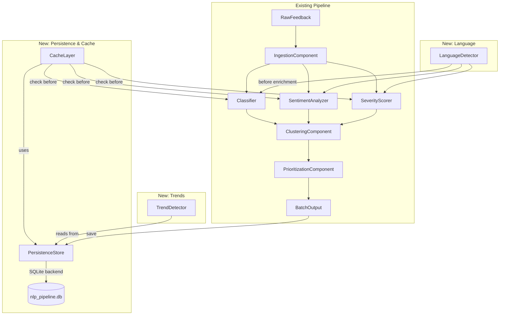

# Design Document: NLP Pipeline Enhancements

## Overview

This design extends the existing NLP Feedback Processing pipeline with four capabilities:

1. **Persistence** — A SQLite-backed durable storage layer that saves completed batch outputs and allows retrieval by batch identifier across application restarts.
2. **Caching** — An enrichment result cache that eliminates redundant Gemini API calls when identical feedback text is re-processed within a configurable TTL window.
3. **Trend Detection** — A statistical analysis component that identifies theme frequency spikes, sentiment shifts, and severity escalations by comparing current and historical time windows.
4. **Multi-Language Support** — Language detection for incoming feedback text and language-aware enrichment prompts that produce English-labeled outputs regardless of input language.

All new components follow the project's established patterns: dependency injection for testability, Pydantic v2 for data models, fail-fast configuration validation, and per-record isolation. The persistence layer uses Python's built-in `sqlite3` module (no additional dependency) and provides the shared backend for both batch storage and enrichment caching.

## Architecture



### Integration Points

- **Orchestrator** gains a `PersistenceStore` dependency. After `process_batch` assembles a `BatchOutput`, it persists the result. A new `retrieve_batch(batch_id)` method exposes historical retrieval.
- **Enrichment stage** gains a `CacheLayer` dependency injected into the orchestrator. Before calling Gemini for classification/sentiment/severity, the orchestrator checks the cache. On a cache hit, the enrichment result is returned directly.
- **LanguageDetector** runs immediately after ingestion produces `FeedbackRecord`s and before the enrichment loop. Its output (language code + confidence) is attached as metadata and used to modify Gemini system instructions.
- **TrendDetector** is a standalone component that queries `PersistenceStore` for historical batch data within specified time windows and produces a `TrendReport`.

## Components and Interfaces

### PersistenceStore

```python
class PersistenceStore:
    """Durable storage for batch outputs and cache entries."""

    def __init__(self, backend: str, db_path: str) -> None: ...

    def save_batch(self, batch_output: BatchOutput) -> SaveResult: ...
    def get_batch(self, batch_id: str) -> BatchOutput | None: ...
    def list_batches(self, start: datetime, end: datetime) -> list[BatchMetadata]: ...
    def save_cache_entry(self, key: str, entry: CacheEntry) -> None: ...
    def get_cache_entry(self, key: str) -> CacheEntry | None: ...
    def delete_expired_cache(self, cutoff: datetime) -> int: ...
```

**Design Rationale:** A single `PersistenceStore` class owns both batch persistence and cache storage (Req 2.6 mandates the same backend). The SQLite database uses two tables: `batches` for full batch outputs and `cache_entries` for enrichment results. Using Python's built-in `sqlite3` avoids adding a dependency.

### CacheLayer

```python
class CacheLayer:
    """Enrichment result cache backed by PersistenceStore."""

    def __init__(self, store: PersistenceStore, ttl_hours: int = 24, enabled: bool = True) -> None: ...

    def get(self, cleaned_text: str, language_code: str) -> CachedEnrichment | None: ...
    def put(self, cleaned_text: str, language_code: str, result: CachedEnrichment) -> None: ...
    def compute_key(self, cleaned_text: str, language_code: str) -> str: ...
```

**Design Rationale:** The cache key is a SHA-256 hash of `cleaned_text + language_code` (Req 2.1 keys by text hash; Req 6.7 includes language in the key). The `CacheLayer` is a thin wrapper over `PersistenceStore` that handles TTL expiry checks and the enabled/disabled toggle. When disabled (Req 2.7), `get` always returns `None` and `put` is a no-op. When the store is unavailable, methods return `None`/no-op and the caller proceeds without cache (Req 2.8).

### LanguageDetector

```python
class LanguageDetector:
    """Identifies the natural language of feedback text."""

    def __init__(self, client: GeminiClient | GenerateFn, supported_languages: frozenset[str] | None = None) -> None: ...

    def detect(self, record: FeedbackRecord) -> LanguageDetectionResult: ...
```

**Design Rationale:** Language detection uses the Gemini API with a focused schema-constrained prompt that returns an ISO 639-1 code and confidence. This avoids adding a third-party language detection library while leveraging the existing `GeminiClient` infrastructure (retry, timeout, secret redaction). Supported languages default to `{"en", "es", "fr", "de", "pt"}` (Req 5.2). When confidence < 0.6 or the detected language is unsupported, defaults to "en" (Req 5.4).

### TrendDetector

```python
class TrendDetector:
    """Identifies theme frequency spikes, sentiment shifts, and severity escalations."""

    def __init__(self, store: PersistenceStore, config: TrendConfig) -> None: ...

    def detect_trends(self, baseline: TimeWindow, current: TimeWindow) -> TrendReport: ...
```

**Design Rationale:** The `TrendDetector` reads persisted `InsightRecord`s within the specified windows from `PersistenceStore`. It computes theme frequency distributions, sentiment proportions, and mean severity in each window, then applies configurable thresholds to identify significant changes. The minimum 10-record requirement (Req 3.6, 4.6) prevents unreliable statistics from small samples.

### Configuration Extensions

```python
# New configuration fields added to Config or a new PipelineConfig wrapper
class PersistenceConfig:
    backend: str  # "sqlite" (extensible later)
    db_path: str  # file path for SQLite

class CacheConfig:
    enabled: bool  # default True
    ttl_hours: int  # 1..720, default 24

class TrendConfig:
    spike_threshold_pct: int  # 1..1000, default 50
    sentiment_shift_ppt: int  # 1..50, default 15
    severity_escalation: float  # 0.5..4.0, default 1.0
```

## Data Models

### New Pydantic Models

```python
class BatchMetadata(BaseModel):
    """Metadata for a persisted batch."""
    batch_id: str
    timestamp: str  # ISO 8601 UTC
    status: Literal["completed"]
    record_count: int


class SaveResult(BaseModel):
    """Outcome of a batch save operation."""
    batch_id: str
    success: bool
    error: str | None = None


class CachedEnrichment(BaseModel):
    """Cached enrichment result for a single feedback text."""
    themes: list[ThemeAssignment]
    sentiment: SentimentValue
    sentiment_confidence: float = Field(ge=0.0, le=1.0)
    severity_score: int = Field(ge=1, le=5)
    severity_factors: list[SeverityFactor]
    cached_at: str  # ISO 8601 UTC


class CacheEntry(BaseModel):
    """Storage representation of a cache entry with TTL tracking."""
    key: str
    enrichment: CachedEnrichment
    created_at: str  # ISO 8601 UTC
    expires_at: str  # ISO 8601 UTC


class LanguageDetectionResult(BaseModel):
    """Output of language detection for a FeedbackRecord."""
    record_id: str
    language_code: str  # ISO 639-1
    confidence: float = Field(ge=0.0, le=1.0)
    is_uncertain: bool = False
    note: str | None = None


class TimeWindow(BaseModel):
    """A start/end time range for trend analysis."""
    start: str  # ISO 8601 UTC
    end: str  # ISO 8601 UTC


class ThemeSpike(BaseModel):
    """A single theme whose frequency spiked."""
    theme: str
    baseline_frequency: float = Field(ge=0.0, le=1.0)
    current_frequency: float = Field(ge=0.0, le=1.0)
    percentage_increase: float | str  # float or "new" for new themes


class SentimentShift(BaseModel):
    """An identified shift in negative sentiment proportion."""
    baseline_negative_proportion: float = Field(ge=0.0, le=1.0)
    current_negative_proportion: float = Field(ge=0.0, le=1.0)
    difference_ppt: float  # percentage points


class SeverityEscalation(BaseModel):
    """An identified escalation in mean severity."""
    baseline_mean_severity: float = Field(ge=1.0, le=5.0)
    current_mean_severity: float = Field(ge=1.0, le=5.0)
    difference: float


class TrendReport(BaseModel):
    """Complete trend analysis output."""
    theme_spikes: list[ThemeSpike] = Field(default_factory=list)
    sentiment_shifts: list[SentimentShift] = Field(default_factory=list)
    severity_escalations: list[SeverityEscalation] = Field(default_factory=list)
    notes: list[str] = Field(default_factory=list)
```

### SQLite Schema

```sql
CREATE TABLE IF NOT EXISTS batches (
    batch_id TEXT PRIMARY KEY,
    timestamp TEXT NOT NULL,         -- ISO 8601 UTC
    status TEXT NOT NULL DEFAULT 'completed',
    payload TEXT NOT NULL             -- JSON-serialized BatchOutput
);

CREATE TABLE IF NOT EXISTS cache_entries (
    key TEXT PRIMARY KEY,
    language_code TEXT NOT NULL,
    enrichment TEXT NOT NULL,          -- JSON-serialized CachedEnrichment
    created_at TEXT NOT NULL,
    expires_at TEXT NOT NULL
);

CREATE INDEX IF NOT EXISTS idx_cache_expires ON cache_entries(expires_at);
CREATE INDEX IF NOT EXISTS idx_batches_timestamp ON batches(timestamp);
```

### InsightRecord Extension

The existing `InsightRecord` model gains an optional `language_code` field and `language_confidence` field:

```python
class InsightRecord(BaseModel):
    # ... existing fields ...
    language_code: str | None = None  # ISO 639-1; None for legacy records
    language_confidence: float | None = None  # 0.0..1.0
```

This is backwards-compatible: existing records without language data remain valid (`None` defaults).

## Correctness Properties

*A property is a characteristic or behavior that should hold true across all valid executions of a system — essentially, a formal statement about what the system should do. Properties serve as the bridge between human-readable specifications and machine-verifiable correctness guarantees.*

### Property 1: Batch persistence round-trip

*For any* valid `BatchOutput`, saving it to the `PersistenceStore` and then retrieving it by its assigned batch identifier SHALL produce an object whose `InsightRecord`s, `Cluster`s, `FailureEntry`s, `BatchSummary`, timestamp, and status are field-by-field equal to those of the originally saved `BatchOutput`.

**Validates: Requirements 1.1, 1.3, 1.6, 1.7**

### Property 2: Batch metadata assignment

*For any* saved batch, the `PersistenceStore` SHALL assign a non-empty unique batch identifier, a valid ISO 8601 UTC timestamp, and a status of "completed".

**Validates: Requirements 1.2**

### Property 3: Cache key determinism

*For any* `cleaned_text` string and `language_code`, calling `compute_key(cleaned_text, language_code)` multiple times SHALL always produce the same hash value.

**Validates: Requirements 2.1**

### Property 4: Cache enrichment round-trip

*For any* valid `CachedEnrichment`, storing it in the `CacheLayer` via `put` and then retrieving it via `get` with the same `cleaned_text` and `language_code` (before TTL expiry) SHALL produce classification themes, sentiment, sentiment_confidence, severity_score, and severity_factors that are field-by-field identical to the originally stored enrichment.

**Validates: Requirements 2.2, 2.9**

### Property 5: Cache TTL validation

*For any* integer value in the inclusive range 1 to 720, constructing the `CacheLayer` with that TTL SHALL succeed. *For any* value that is not an integer or falls outside the range 1 to 720, construction SHALL raise a `ConfigurationError`.

**Validates: Requirements 2.3, 2.4**

### Property 6: Cache TTL expiry

*For any* `CachedEnrichment` whose creation time plus the configured TTL is earlier than the current time, calling `get` SHALL return `None` (the stale entry is discarded).

**Validates: Requirements 2.5**

### Property 7: Disabled cache bypass

*For any* `cleaned_text` and `language_code`, when the `CacheLayer` is constructed with `enabled=False`, calling `get` SHALL always return `None`.

**Validates: Requirements 2.7**

### Property 8: Theme frequency computation

*For any* set of `InsightRecord`s, the computed relative frequency of a theme SHALL equal the number of records assigned that theme divided by the total number of records in the set. Each record contributes once per distinct theme assigned to it.

**Validates: Requirements 3.2**

### Property 9: Theme spike detection

*For any* baseline and current theme frequency distributions and a configured spike threshold, a theme SHALL be identified as a spike if and only if its relative percentage increase `((current - baseline) / baseline × 100)` is at least the threshold, or it is a new theme (baseline frequency = 0 and current frequency > 0).

**Validates: Requirements 3.3, 3.4**

### Property 10: Spike ordering

*For any* set of identified theme spikes in a `TrendReport`, the spikes SHALL be ordered by percentage increase descending, and each spike SHALL carry its theme label, baseline frequency, current frequency, and computed percentage increase.

**Validates: Requirements 3.5**

### Property 11: Insufficient data guard

*For any* time window configuration where either the Baseline_Window or Current_Window contains fewer than 10 records, the `TrendDetector` SHALL return no trend findings for that metric and SHALL include an insufficient-data note.

**Validates: Requirements 3.6, 4.6**

### Property 12: Window validation

*For any* pair of time windows where the Baseline_Window start >= end, or the Current_Window start >= end, or the two windows overlap, the `TrendDetector` SHALL reject the request with an error.

**Validates: Requirements 3.8**

### Property 13: Sentiment proportion computation

*For any* set of `InsightRecord`s with sentiment values, the computed proportions of negative, neutral, and positive sentiment SHALL each be in [0.0, 1.0] and SHALL sum to 1.0 (within floating-point tolerance).

**Validates: Requirements 4.1**

### Property 14: Sentiment shift detection

*For any* baseline and current negative sentiment proportions, a sentiment shift SHALL be identified if and only if the current negative proportion exceeds the baseline negative proportion by at least the configured threshold (in percentage points).

**Validates: Requirements 4.2**

### Property 15: Mean severity computation and escalation detection

*For any* set of `InsightRecord`s with severity scores in 1..5, the computed mean severity SHALL be in [1.0, 5.0]. A severity escalation SHALL be identified if and only if the current mean exceeds the baseline mean by at least the configured escalation threshold.

**Validates: Requirements 4.3, 4.4**

### Property 16: Incomplete record exclusion from metrics

*For any* set of records where some lack a sentiment value and others lack a severity score, the sentiment metric computation SHALL exclude records without sentiment (without affecting severity computation) and the severity metric computation SHALL exclude records without severity (without affecting sentiment computation).

**Validates: Requirements 4.7**

### Property 17: Language detection fallback

*For any* language detection result where confidence < 0.6, or the detected language code is not in the supported language set, the `LanguageDetector` SHALL set the language code to "en", assign the actual computed confidence score, record `is_uncertain=True`, and include a language-detection-uncertain note.

**Validates: Requirements 5.4**

### Property 18: Language-aware prompt construction

*For any* detected language code, the Gemini system instruction for enrichment SHALL include the detected language name if and only if the language code is not "en". When language code is "en", no language-override clause SHALL be present.

**Validates: Requirements 6.1, 6.2**

### Property 19: Cache key language differentiation

*For any* `cleaned_text` and two distinct `language_code` values, `compute_key(cleaned_text, lang_a)` SHALL produce a different key than `compute_key(cleaned_text, lang_b)`.

**Validates: Requirements 6.7**

## Error Handling

### Persistence Errors

| Scenario | Behavior |
|----------|----------|
| SQLite write failure on `save_batch` | Return `SaveResult(success=False, error=<reason>)`. Batch is NOT recorded as "completed". Pipeline output is still returned to caller in-memory. |
| SQLite read failure on `get_batch` | Return `None`. Caller treats it as not-found. |
| Invalid/missing backend config at startup | Raise `ConfigurationError` during `PersistenceStore.__init__`. Pipeline does not start. |
| Database file locked by another process | Surface as a save-failure with the lock error message. |

### Cache Errors

| Scenario | Behavior |
|----------|----------|
| Cache read fails (SQLite I/O error) | Return `None` from `get`. Enrichment proceeds via Gemini. Record a cache-failure note on the InsightRecord. |
| Cache write fails after successful enrichment | Log warning, continue. The result is still returned; it just won't be cached for future use. |
| Invalid TTL at startup | Raise `ConfigurationError`. Pipeline does not start. |
| Cache disabled | `get` returns `None`, `put` is a no-op. No errors. |

### Trend Detection Errors

| Scenario | Behavior |
|----------|----------|
| Insufficient data (<10 records in a window) | Return empty findings for that metric with an insufficient-data note. Not an error — an informational result. |
| Invalid window configuration (start >= end, overlap) | Raise `ValueError` with descriptive message before any computation. |
| Persistence store unavailable during trend query | Propagate the exception. Trend detection is an explicit user action, not part of the processing pipeline, so it should surface errors. |

### Language Detection Errors

| Scenario | Behavior |
|----------|----------|
| Gemini unavailable/timeout for language detection | Default to "en" with confidence 0.0, `is_uncertain=True`, and a note. Enrichment continues with English prompts. |
| Gemini returns unsupported language code | Default to "en", record actual confidence, mark uncertain. |
| Gemini returns confidence < 0.6 | Default to "en", record actual confidence, mark uncertain. |
| Language detection response unparseable | Default to "en" with confidence 0.0, mark uncertain, record a parse-failure note. |

### General Principles

- **Persistence failures never block processing.** If `save_batch` fails, the in-memory `BatchOutput` is still returned to the caller. The failure is surfaced via `SaveResult`.
- **Cache failures never block enrichment.** The system degrades gracefully to making Gemini calls, which is the non-cached baseline behavior.
- **Language detection failures never block enrichment.** The system defaults to English, which is the existing baseline behavior.
- **Configuration errors are fail-fast.** Invalid config at startup prevents the pipeline from running with bad settings.

## Testing Strategy

### Testing Framework

- **pytest** for test execution
- **Hypothesis** for property-based testing (already in use)
- **sqlite3** in-memory databases (`:memory:`) for persistence/cache tests — fast, isolated, no filesystem I/O

### Property-Based Tests

Each correctness property above maps to a single Hypothesis property test with a minimum of 100 iterations. Tests are tagged with comments referencing the design property:

```python
# Feature: nlp-pipeline-enhancements, Property 1: Batch persistence round-trip
@given(batch_output=valid_batch_output())
@settings(max_examples=100)
def test_batch_persistence_round_trip(batch_output): ...
```

**PBT Library:** Hypothesis (already a project dependency, version >= 6.100)

**Generators needed (added to `tests/strategies.py`):**
- `valid_batch_output()` — generates complete, valid `BatchOutput` objects
- `valid_cached_enrichment()` — generates valid `CachedEnrichment` objects
- `insight_records_with_themes()` — generates sets of `InsightRecord`s with controlled theme distributions
- `time_window_pair()` — generates valid, non-overlapping `TimeWindow` pairs
- `invalid_time_windows()` — generates windows with start >= end or overlap

### Unit Tests (Example-Based)

| Area | Tests |
|------|-------|
| PersistenceStore | Not-found returns None; invalid backend config raises; SQLite schema creation |
| CacheLayer | Disabled mode; backend failure graceful degradation |
| LanguageDetector | Supported language set; English text detection; format of output |
| TrendDetector | ISO 8601 timestamp parsing; new-theme "new" percentage label |
| Language-aware prompts | English and non-English prompt formats verified against known inputs |

### Integration Tests

| Area | Tests |
|------|-------|
| Full pipeline with persistence | Process a batch, verify it's persisted and retrievable |
| Cache integration | Process same feedback twice, verify second call skips Gemini |
| Trend detection end-to-end | Persist multiple batches, run trend detection, verify report |
| Language detection in pipeline | Process non-English text, verify language metadata flows through |

### Test Organization

```
tests/
  test_persistence.py       # PersistenceStore unit + property tests
  test_cache.py             # CacheLayer unit + property tests
  test_trend_detection.py   # TrendDetector unit + property tests
  test_language_detector.py # LanguageDetector unit tests
  test_language_enrichment.py # Language-aware prompt tests
  strategies.py             # Extended with new generators
```

