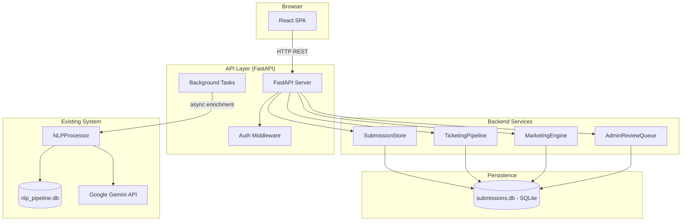
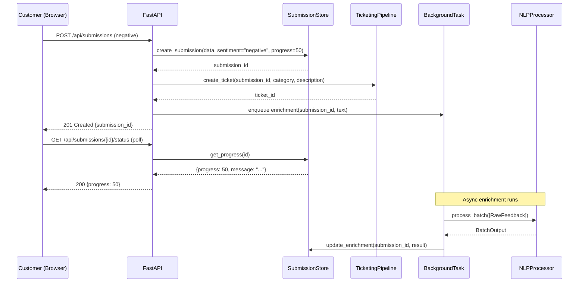

# Design Document: Sentiment-Routed Frontend

## Overview

This design describes a customer-facing, sentiment-routed feedback intake system for Spectrum. It adds a FastAPI REST API and a React SPA frontend on top of the existing NLPProcessor backend. Customers land on a multi-page form, select their sentiment (negative, positive, neutral), complete a sentiment-specific form, and then see a real-time progress tracker. An admin panel enables staff to manage neutral submissions, advance tickets, and view NLP-derived insights and trends.

The system introduces four new backend services — SubmissionStore, TicketingPipeline, MarketingEngine, and AdminReviewQueue — all persisting to a new SQLite database (`submissions.db`) separate from the existing `nlp_pipeline.db`. NLP enrichment is performed asynchronously via background tasks that invoke the existing NLPProcessor.

### Key Design Decisions

| Decision | Rationale |
|----------|-----------|
| FastAPI for the REST layer | Native async support, Pydantic v2 integration matches existing models, auto-generated OpenAPI docs |
| React SPA with React Router | Component-driven UI fits the multi-page form flow; widespread ecosystem; good polling/state management story |
| Separate SQLite database for submissions | Keeps submission lifecycle data decoupled from NLP batch persistence; avoids schema conflicts |
| Session-based auth with signed tokens | Simpler than OAuth for internal staff; 8-hour expiry meets requirement; no external identity provider needed |
| Polling (not WebSockets) for status | Requirements specify polling; simpler infrastructure; adequate for 5–10s update intervals |
| Background tasks for NLP enrichment | Submission creation must not block on Gemini API; FastAPI BackgroundTasks provides this natively |

## Architecture



### Request Flow (Negative Submission Example)



## Components and Interfaces

### Frontend Components (React SPA)

| Component | Responsibility |
|-----------|---------------|
| `App` | Root component, React Router provider |
| `LandingPage` | Page 1: name, email, phone, core request |
| `SentimentSelect` | Page 2: three sentiment cards with immediate navigation |
| `NegativeForm` | Page 3A: issue category dropdown + detailed description |
| `PositiveForm` | Page 3B: praise textarea + social sharing toggle |
| `NeutralForm` | Page 3C: comment textarea |
| `StatusTracker` | Pages 4A/4B/4C: progress bar + message + polling logic |
| `AdminLogin` | Admin login form |
| `AdminDashboard` | Summary stats, trend charts, issue category ranking |
| `ReviewQueue` | Paginated neutral submission list with sort actions |
| `TicketList` | Open/in-progress tickets with status advance buttons |
| `MarketingLog` | Paginated positive submissions with sharing status |
| `TrendAnalysis` | Time window selector + trend report display |

### Frontend State Management

- **React Context** for auth state (session token, admin user info)
- **Component-local state** for form data (controlled inputs, validation errors)
- **Custom hook `usePolling`** encapsulates polling logic with exponential backoff
- **React Router** for page navigation; submission ID passed via URL params

### Backend API Endpoints

| Method | Path | Auth | Description |
|--------|------|------|-------------|
| POST | `/api/submissions` | Public | Create a new submission |
| GET | `/api/submissions/{id}/status` | Public | Get progress state + enrichment |
| GET | `/api/submissions/{id}` | Admin | Get full submission record with history |
| POST | `/api/auth/login` | Public | Authenticate admin, receive session token |
| POST | `/api/auth/logout` | Admin | Invalidate session |
| GET | `/api/admin/queue` | Admin | List review queue (paginated) |
| PATCH | `/api/admin/queue/{id}/sort` | Admin | Sort neutral submission to neg/pos |
| GET | `/api/admin/tickets` | Admin | List open/in-progress tickets |
| PATCH | `/api/admin/tickets/{id}/advance` | Admin | Advance ticket status |
| GET | `/api/admin/dashboard` | Admin | Summary stats |
| GET | `/api/admin/marketing` | Admin | Paginated marketing log |
| POST | `/api/admin/trends` | Admin | Run trend analysis |

### Backend Service Interfaces

```python
class SubmissionStore:
    def create(self, data: SubmissionCreate) -> Submission: ...
    def get(self, submission_id: UUID) -> Submission | None: ...
    def get_status(self, submission_id: UUID) -> StatusResponse | None: ...
    def update_progress(self, submission_id: UUID, new_state: int) -> None: ...
    def update_enrichment(self, submission_id: UUID, result: EnrichmentResult) -> None: ...
    def mark_enrichment_failed(self, submission_id: UUID, reason: str) -> None: ...
    def list_by_sentiment(self, sentiment: str, limit: int, offset: int) -> list[Submission]: ...
    def count_by_sentiment(self) -> dict[str, int]: ...

class TicketingPipeline:
    def create_ticket(self, submission_id: UUID, category: str, description: str) -> Ticket: ...
    def advance_status(self, ticket_id: UUID) -> Ticket: ...
    def list_active(self) -> list[Ticket]: ...
    def get_ticket(self, ticket_id: UUID) -> Ticket | None: ...

class MarketingEngine:
    def log_praise(self, submission_id: UUID, name: str, praise: str, social_sharing: bool) -> None: ...
    def generate_share(self, submission_id: UUID) -> ShareResult: ...
    def list_entries(self, limit: int, offset: int) -> list[MarketingEntry]: ...

class AdminReviewQueue:
    def enqueue(self, submission_id: UUID) -> None: ...
    def list_queue(self, limit: int, offset: int) -> list[QueueEntry]: ...
    def remove(self, submission_id: UUID) -> None: ...
    def is_queued(self, submission_id: UUID) -> bool: ...
```

### Authentication Service

```python
class AuthService:
    def login(self, username: str, password: str) -> SessionToken: ...
    def logout(self, token: str) -> None: ...
    def validate_token(self, token: str) -> AdminUser | None: ...
    def is_locked(self, username: str) -> bool: ...
    def record_failure(self, username: str) -> None: ...
    def clear_failures(self, username: str) -> None: ...
```

## Data Models

### Submission

```python
from pydantic import BaseModel, Field
from uuid import UUID
from typing import Literal
from datetime import datetime

class SubmissionCreate(BaseModel):
    """Payload for POST /api/submissions"""
    customer_name: str = Field(min_length=1, max_length=100)
    email: str | None = None  # pattern: local@domain.tld
    phone: str | None = None  # 7-15 digits, optional + prefix
    core_request: str = Field(min_length=1, max_length=5000)
    sentiment: Literal["negative", "positive", "neutral"]
    # Negative-specific
    issue_category: str | None = None
    detailed_description: str | None = None  # 10-5000 chars
    # Positive-specific
    praise_text: str | None = None  # 1-2000 chars
    social_sharing: bool = False
    # Neutral-specific
    comment_text: str | None = None  # 1-5000 chars

class StateTransition(BaseModel):
    """Records a progress state change."""
    previous_state: int
    new_state: int
    timestamp: datetime

class EnrichmentResult(BaseModel):
    """NLP analysis output stored on a submission."""
    themes: list[dict]  # [{theme: str, confidence: float}]
    sentiment_confidence: float = Field(ge=0.0, le=1.0)
    severity_score: int = Field(ge=1, le=5)
    severity_factors: list[str]
    language_code: str | None = None
    language_confidence: float | None = Field(default=None, ge=0.0, le=1.0)

class Submission(BaseModel):
    """Full submission record."""
    id: UUID
    created_at: datetime
    customer_name: str
    email: str | None = None
    phone: str | None = None
    core_request: str
    sentiment: Literal["negative", "positive", "neutral"]
    progress_state: int  # 25, 50, 75, or 100
    issue_category: str | None = None
    detailed_description: str | None = None
    praise_text: str | None = None
    social_sharing: bool = False
    comment_text: str | None = None
    enrichment_status: Literal["pending", "completed", "failed", "timeout"]
    enrichment_result: EnrichmentResult | None = None
    state_transitions: list[StateTransition] = []

class StatusResponse(BaseModel):
    """Public-facing status for polling."""
    submission_id: UUID
    progress_state: int
    sentiment: Literal["negative", "positive", "neutral"]
    message: str
    enrichment_status: str
```

### Ticket

```python
class Ticket(BaseModel):
    """Support ticket for negative submissions."""
    id: UUID
    submission_id: UUID
    issue_category: str
    description: str = Field(max_length=5000)
    priority: Literal["high"] = "high"
    status: Literal["open", "in_progress", "resolved"]
    created_at: datetime
```

### Marketing Entry

```python
class MarketingEntry(BaseModel):
    """Marketing log entry for positive submissions."""
    submission_id: UUID
    customer_name: str
    praise_text: str
    social_sharing: bool
    social_status: Literal["shared", "internal_only", "generation_failed"]
    shareable_url: str | None = None
    logged_at: datetime

class ShareResult(BaseModel):
    """Output of social share generation."""
    shareable_url: str
    email_template: str
```

### Admin Auth

```python
class SessionToken(BaseModel):
    """Issued on successful login."""
    token: str
    expires_at: datetime
    username: str

class AdminUser(BaseModel):
    """Decoded session identity."""
    username: str
    token: str
```

### SQLite Schema (submissions.db)

```sql
CREATE TABLE submissions (
    id TEXT PRIMARY KEY,               -- UUID
    created_at TEXT NOT NULL,           -- ISO 8601 UTC
    customer_name TEXT NOT NULL,
    email TEXT,
    phone TEXT,
    core_request TEXT NOT NULL,
    sentiment TEXT NOT NULL CHECK(sentiment IN ('negative','positive','neutral')),
    progress_state INTEGER NOT NULL CHECK(progress_state IN (25,50,75,100)),
    issue_category TEXT,
    detailed_description TEXT,
    praise_text TEXT,
    social_sharing INTEGER NOT NULL DEFAULT 0,
    comment_text TEXT,
    enrichment_status TEXT NOT NULL DEFAULT 'pending'
        CHECK(enrichment_status IN ('pending','completed','failed','timeout')),
    enrichment_result TEXT              -- JSON blob
);

CREATE TABLE state_transitions (
    id INTEGER PRIMARY KEY AUTOINCREMENT,
    submission_id TEXT NOT NULL REFERENCES submissions(id),
    previous_state INTEGER NOT NULL,
    new_state INTEGER NOT NULL,
    timestamp TEXT NOT NULL             -- ISO 8601 UTC
);

CREATE TABLE tickets (
    id TEXT PRIMARY KEY,               -- UUID
    submission_id TEXT NOT NULL REFERENCES submissions(id),
    issue_category TEXT NOT NULL,
    description TEXT NOT NULL,
    priority TEXT NOT NULL DEFAULT 'high',
    status TEXT NOT NULL DEFAULT 'open'
        CHECK(status IN ('open','in_progress','resolved')),
    created_at TEXT NOT NULL            -- ISO 8601 UTC
);

CREATE TABLE marketing_log (
    id INTEGER PRIMARY KEY AUTOINCREMENT,
    submission_id TEXT NOT NULL REFERENCES submissions(id),
    customer_name TEXT NOT NULL,
    praise_text TEXT NOT NULL,
    social_sharing INTEGER NOT NULL DEFAULT 0,
    social_status TEXT NOT NULL DEFAULT 'internal_only'
        CHECK(social_status IN ('shared','internal_only','generation_failed')),
    shareable_url TEXT,
    logged_at TEXT NOT NULL             -- ISO 8601 UTC
);

CREATE TABLE admin_review_queue (
    submission_id TEXT PRIMARY KEY REFERENCES submissions(id),
    queued_at TEXT NOT NULL             -- ISO 8601 UTC
);

CREATE TABLE admin_users (
    username TEXT PRIMARY KEY,
    password_hash TEXT NOT NULL,
    failed_attempts INTEGER NOT NULL DEFAULT 0,
    locked_until TEXT                   -- ISO 8601 UTC or NULL
);

CREATE TABLE sessions (
    token TEXT PRIMARY KEY,
    username TEXT NOT NULL REFERENCES admin_users(username),
    created_at TEXT NOT NULL,
    expires_at TEXT NOT NULL,
    invalidated INTEGER NOT NULL DEFAULT 0
);
```


## Correctness Properties

*A property is a characteristic or behavior that should hold true across all valid executions of a system — essentially, a formal statement about what the system should do. Properties serve as the bridge between human-readable specifications and machine-verifiable correctness guarantees.*

### Property 1: Sentiment determines initial progress state

*For any* valid submission, the initial Progress_State SHALL be determined solely by the sentiment route: negative → 50%, positive → 100%, neutral → 25%.

**Validates: Requirements 3.3, 4.2, 5.2**

### Property 2: Form validation rejects invalid inputs

*For any* submission form input that violates validation rules (name empty after trim, no contact info, email not matching pattern, phone not 7–15 digits, negative description < 10 chars, neutral comment whitespace-only), the system SHALL reject the submission and prevent API calls.

**Validates: Requirements 1.2, 3.7, 5.3**

### Property 3: Data retained across page navigation

*For any* valid Page 1 form data (name, email, phone, core request), when navigating through sentiment selection to any Page 3 form and submitting, the final submission payload SHALL include all Page 1 field values unchanged.

**Validates: Requirements 2.5**

### Property 4: Negative submission always creates high-priority ticket

*For any* valid negative submission, a Ticket SHALL be created with priority "high", status "open", a unique UUID, the selected Issue_Category, and a link to the submission identifier.

**Validates: Requirements 3.4, 16.1**

### Property 5: Social sharing controls marketing outbound behavior

*For any* positive submission, if social_sharing is true, the Marketing_Engine SHALL generate a shareable URL and email template; if social_sharing is false, the Marketing_Engine SHALL log for internal use only with social_status "internal_only" and no shareable URL.

**Validates: Requirements 4.4, 4.5, 17.2, 17.3**

### Property 6: Neutral submissions always queued for admin review

*For any* valid neutral submission, the submission identifier SHALL appear in the Admin_Review_Queue immediately after creation.

**Validates: Requirements 5.4**

### Property 7: Progress state maps to correct message and bar percentage

*For any* submission with a given Progress_State and sentiment route, the displayed progress bar percentage and status message SHALL be: 25% → "Awaiting Review" (neutral only), 50% → "Spectrum is working on this.", 75% → "Almost there — resolution in progress.", 100% → completion message (sentiment-specific). Furthermore, when Progress_State reaches 100%, polling SHALL stop.

**Validates: Requirements 6.3, 6.4, 8.3, 8.4, 8.6, 8.7, 12.3**

### Property 8: Exponential backoff computation

*For any* sequence of n consecutive polling failures (1 ≤ n ≤ 10), the retry interval SHALL be min(5 × 2^(n−1), 60) seconds. After 10 consecutive failures, polling SHALL stop and an error message SHALL be displayed.

**Validates: Requirements 6.5, 12.4, 12.5**

### Property 9: Admin endpoints require valid authentication

*For any* request to an admin-only endpoint, if the request lacks a session token or presents an expired or invalidated token, the API_Server SHALL return 401 Unauthorized without executing the operation.

**Validates: Requirements 9.1, 9.5**

### Property 10: Session token expires within 8 hours

*For any* successfully authenticated login, the issued session token SHALL have an expiration time no more than 8 hours from the time of issuance.

**Validates: Requirements 9.2**

### Property 11: Authentication error uniformity

*For any* failed login attempt (wrong username, wrong password, or both), the API_Server SHALL return the same 401 error response without revealing which credential was incorrect.

**Validates: Requirements 9.3**

### Property 12: Account lockout after 5 consecutive failures

*For any* username that accumulates 5 consecutive failed login attempts, the API_Server SHALL reject all further login attempts for that username for at least 60 seconds, including attempts with correct credentials.

**Validates: Requirements 9.6**

### Property 13: Review queue ordered by submission timestamp ascending

*For any* set of submissions in the Admin_Review_Queue, the list endpoint SHALL return them ordered by submission timestamp ascending (oldest first).

**Validates: Requirements 10.1**

### Property 14: Sort-to-negative atomicity

*For any* neutral submission in the Admin_Review_Queue, sorting it to negative with a valid Issue_Category SHALL atomically: (1) create a high-priority Ticket, (2) update the submission Progress_State to 50%, and (3) remove the submission from the queue.

**Validates: Requirements 10.3**

### Property 15: Sort-to-positive atomicity

*For any* neutral submission in the Admin_Review_Queue, sorting it to positive SHALL atomically: (1) log the submission in the Marketing_Engine, (2) update the submission Progress_State to 100%, and (3) remove the submission from the queue.

**Validates: Requirements 10.4**

### Property 16: Sort failure leaves queue unchanged

*For any* sort operation where the downstream service (TicketingPipeline or MarketingEngine) fails, the submission SHALL remain in the Admin_Review_Queue with its Progress_State unchanged.

**Validates: Requirements 10.6**

### Property 17: 409 Conflict on already-sorted submission

*For any* submission that has already been sorted (no longer in neutral/unsorted state), a PATCH sort request SHALL return 409 Conflict.

**Validates: Requirements 11.6**

### Property 18: API payload validation returns 422

*For any* request payload that fails Pydantic v2 validation (missing required fields, type errors, constraint violations), the API_Server SHALL return 422 Unprocessable Entity with field-level error details.

**Validates: Requirements 11.7**

### Property 19: Non-existent submission IDs return 404

*For any* submission identifier that does not exist in the Submission_Store or is not a valid UUID, GET requests SHALL return 404 Not Found.

**Validates: Requirements 11.3, 14.5**

### Property 20: RawFeedback constructed with source_channel "social_post"

*For any* web submission passed to the NLPProcessor, the constructed RawFeedback object SHALL have source_channel "social_post" and the submission text as the feedback text.

**Validates: Requirements 13.1**

### Property 21: Enrichment result extraction from BatchOutput

*For any* BatchOutput containing at least one InsightRecord, the API_Server SHALL extract themes (with confidence), sentiment_confidence, severity_score, severity_factors, language_code, and language_confidence from the first InsightRecord and store them as the Enrichment_Result with status "completed".

**Validates: Requirements 13.2, 13.6**

### Property 22: Enrichment failure classification

*For any* BatchOutput with zero InsightRecords and at least one FailureEntry, the enrichment_status SHALL be set to "failed" with the failure stage and reason stored on the submission.

**Validates: Requirements 13.3**

### Property 23: Submission persistence round-trip

*For any* valid SubmissionCreate payload, creating a submission and then retrieving it by ID SHALL return a record where all persisted fields (name, contact, request, sentiment, progress, form-specific fields) match the original payload.

**Validates: Requirements 14.1, 14.4**

### Property 24: State transition audit trail

*For any* Progress_State change on a submission, the Submission_Store SHALL record a StateTransition entry with the correct previous state, new state, and ISO 8601 UTC timestamp, preserving all prior transitions in chronological order.

**Validates: Requirements 14.3**

### Property 25: Dashboard aggregation correctness

*For any* set of submissions in the store, the dashboard summary SHALL report counts by sentiment route and Progress_State that exactly match the actual data.

**Validates: Requirements 15.1**

### Property 26: Invalid TimeWindow rejection

*For any* TimeWindow pair where baseline start ≥ baseline end, current start ≥ current end, or the two windows overlap, the API_Server SHALL return a validation error without invoking the NLPProcessor.

**Validates: Requirements 15.4**

### Property 27: Top 5 category ranking by frequency

*For any* set of negative submissions, the top 5 Issue_Categories displayed SHALL be ordered by submission frequency descending, and the frequency counts SHALL match the actual number of submissions per category.

**Validates: Requirements 15.5**

### Property 28: Ticket state machine valid transitions

*For any* Ticket, the only valid status transitions SHALL be "open" → "in_progress" and "in_progress" → "resolved". All other transitions SHALL be rejected with an error.

**Validates: Requirements 16.2, 16.6**

### Property 29: Ticket state drives submission progress

*For any* Ticket transitioning to "in_progress", the linked Submission Progress_State SHALL become 75%. For any Ticket transitioning to "resolved", the linked Submission Progress_State SHALL become 100%.

**Validates: Requirements 16.3, 16.4**

### Property 30: PII removed from share templates

*For any* positive submission with social sharing enabled, the generated email template SHALL NOT contain the customer name or contact information (email, phone).

**Validates: Requirements 17.2**

## Error Handling

### Frontend Error Handling

| Scenario | Behavior |
|----------|----------|
| Form validation failure | Display field-level errors inline; preserve all field values |
| Network error on submission | Show toast/banner: "Could not reach server. Please retry." |
| API returns 422 | Map field errors to form fields; display validation messages |
| API returns 5xx | Show generic error: "Something went wrong. Please try again." |
| Polling network failure | Exponential backoff (5s base, 60s max); show last known state |
| 10 consecutive poll failures | Stop polling; show "Connection lost" message with manual retry button |
| Missing submission ID in URL | Show "Submission not found" error; no polling initiated |
| Session expired (admin) | Redirect to login; show "Session expired, please log in again" |

### Backend Error Handling

| Scenario | HTTP Status | Behavior |
|----------|-------------|----------|
| Invalid payload | 422 | Pydantic validation errors returned as JSON |
| Submission not found | 404 | `{"detail": "Submission not found"}` |
| Unauthenticated | 401 | `{"detail": "Authentication required"}` |
| Invalid credentials | 401 | `{"detail": "Authentication failed"}` — same message always |
| Account locked | 401 | `{"detail": "Authentication failed"}` — same message (no lockout leak) |
| Sort conflict (non-neutral) | 409 | `{"detail": "Submission already sorted"}` |
| Invalid ticket transition | 409 | `{"detail": "Invalid status transition"}` |
| Invalid TimeWindow | 422 | `{"detail": "Invalid time window configuration: ..."}` |
| NLP enrichment exception | — | Log error; store submission without enrichment; set status "failed" |
| NLP enrichment timeout | — | After 30s, mark enrichment_status "timeout" |
| Marketing_Engine failure | 500 | Return error; leave submission in queue unchanged |
| Storage failure | 500 | `{"detail": "Internal server error"}` — don't acknowledge creation |
| Ticketing failure on sort | 500 | Return error; leave submission in queue with state unchanged |

### Resilience Patterns

1. **Async enrichment**: Submission creation never blocks on Gemini. If enrichment fails or times out, the submission remains valid and accessible — enrichment can be retried manually.
2. **Sort atomicity**: Sort operations use database transactions. If any step fails, the entire operation rolls back (submission stays in queue, progress unchanged).
3. **Graceful degradation**: If Marketing_Engine fails during positive submission, the submission is still stored and the customer proceeds to the status page with a warning.
4. **Rate limiting**: Account lockout prevents brute-force attacks without leaking information about valid usernames.

## Testing Strategy

### Testing Framework Choices

| Layer | Framework | Purpose |
|-------|-----------|---------|
| Backend unit/property tests | pytest + Hypothesis | Pure logic, state machines, data transformations |
| Backend integration tests | pytest + httpx (TestClient) | FastAPI endpoint testing |
| Frontend unit tests | Vitest + React Testing Library | Component rendering, validation logic |
| Frontend property tests | fast-check | Validation rules, state mapping functions |
| E2E tests | Playwright | Full user flows across frontend + backend |

### Property-Based Testing Configuration

- **Backend**: Hypothesis with `@settings(max_examples=100)` minimum per property
- **Frontend**: fast-check with `fc.assert(property, { numRuns: 100 })` minimum
- Each property test tagged with: `Feature: sentiment-routed-frontend, Property {N}: {title}`

### Unit Tests (Example-Based)

- Landing page renders all required fields (1.1)
- Sentiment page shows exactly three options (2.1)
- Navigation on sentiment selection (2.2, 2.3, 2.4)
- Negative form renders dropdown with correct categories (3.2)
- Positive form defaults social sharing to off (4.1)
- Status page displays correct initial state (6.1, 7.1, 8.1)
- Logout invalidates session (9.4)
- Error responses for API failures (3.8, 4.8, 4.9, 5.7, 5.8)
- Marketing log displays sharing status labels (17.4)
- Empty state displays (15.6)

### Property-Based Tests (Universal)

Each correctness property (1–30) maps to one property-based test. Key generators:

- **SubmissionCreate generator**: Random valid/invalid payloads across all sentiment types
- **Progress state generator**: Values from {25, 50, 75, 100}
- **Ticket status generator**: Values from {"open", "in_progress", "resolved"}
- **TimeWindow generator**: Random ISO 8601 date pairs (valid and invalid)
- **Session token generator**: Valid/expired/invalidated tokens
- **Issue category generator**: Random selection from the 6 valid categories
- **Whitespace string generator**: Strings composed entirely of whitespace characters

### Integration Tests

- Full submission flow: create → poll → enrich → status update
- Admin sort flow: queue → sort → ticket/marketing → progress visible
- NLP enrichment: submission → background task → BatchOutput → EnrichmentResult stored
- Polling timing: intervals within 3–10s range
- Status update propagation: change visible within 5 seconds

### E2E Tests

- Complete negative path: landing → sentiment → negative form → status tracking → resolution
- Complete positive path: landing → sentiment → positive form → confirmation
- Complete neutral path: landing → sentiment → neutral form → admin sorts → status update
- Admin flow: login → queue management → ticket advancement → trend analysis
