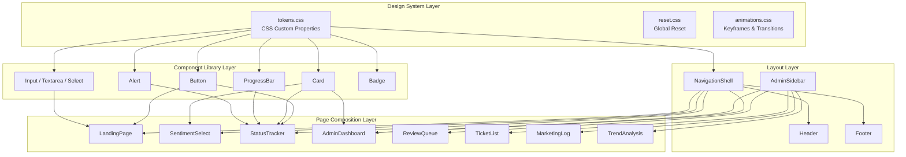

# Design Document: Spectrum UI Redesign

## Overview

This design specifies the architecture for a comprehensive UI redesign of the existing Spectrum customer feedback application. The redesign introduces a design token system, a reusable component library, a responsive page layout shell, and branded page-level compositions — all built with vanilla CSS custom properties (no CSS framework) atop the existing React 18 + TypeScript + Vite stack.

The approach is additive: existing page logic and routing remain intact. The redesign wraps all pages in a new `NavigationShell` layout component, replaces inline HTML elements with branded components, and layers the design token system as a global CSS foundation.

### Key Design Decisions

1. **CSS Custom Properties over CSS-in-JS**: Tokens are defined as CSS custom properties on `:root`. This keeps the design system framework-agnostic, leverages native cascade behavior, and avoids runtime style generation costs.

2. **CSS Modules for component scoping**: Each component gets a co-located `.module.css` file to prevent class name collisions while keeping styles statically analyzable.

3. **No external component library**: We build all UI primitives in-house to maintain full control over Spectrum branding, accessibility, and bundle size.

4. **Layout via CSS Grid + Flexbox**: The navigation shell uses CSS Grid for the overall page structure (header/main/footer) and Flexbox for interior alignment, enabling responsive behavior without media query complexity.

5. **Progressive enhancement for animations**: All animations respect `prefers-reduced-motion` via a single CSS media query that disables transitions globally.

## Architecture



### File Structure

```
frontend/src/
├── styles/
│   ├── tokens.css              # Design tokens (CSS custom properties on :root)
│   ├── reset.css               # CSS reset + global typography
│   ├── animations.css          # Keyframe definitions + reduced-motion query
│   └── index.css               # Barrel import of all global styles
├── components/
│   ├── ui/
│   │   ├── Button/
│   │   │   ├── Button.tsx
│   │   │   ├── Button.module.css
│   │   │   └── Button.test.tsx
│   │   ├── Input/
│   │   │   ├── Input.tsx
│   │   │   ├── Input.module.css
│   │   │   └── Input.test.tsx
│   │   ├── Textarea/
│   │   │   ├── Textarea.tsx
│   │   │   ├── Textarea.module.css
│   │   │   └── Textarea.test.tsx
│   │   ├── Select/
│   │   │   ├── Select.tsx
│   │   │   ├── Select.module.css
│   │   │   └── Select.test.tsx
│   │   ├── Card/
│   │   │   ├── Card.tsx
│   │   │   ├── Card.module.css
│   │   │   └── Card.test.tsx
│   │   ├── ProgressBar/
│   │   │   ├── ProgressBar.tsx
│   │   │   ├── ProgressBar.module.css
│   │   │   └── ProgressBar.test.tsx
│   │   ├── Alert/
│   │   │   ├── Alert.tsx
│   │   │   ├── Alert.module.css
│   │   │   └── Alert.test.tsx
│   │   └── Badge/
│   │       ├── Badge.tsx
│   │       ├── Badge.module.css
│   │       └── Badge.test.tsx
│   ├── layout/
│   │   ├── NavigationShell/
│   │   │   ├── NavigationShell.tsx
│   │   │   ├── NavigationShell.module.css
│   │   │   └── NavigationShell.test.tsx
│   │   ├── Header/
│   │   │   ├── Header.tsx
│   │   │   ├── Header.module.css
│   │   │   └── Header.test.tsx
│   │   ├── Footer/
│   │   │   ├── Footer.tsx
│   │   │   ├── Footer.module.css
│   │   │   └── Footer.test.tsx
│   │   ├── AdminSidebar/
│   │   │   ├── AdminSidebar.tsx
│   │   │   ├── AdminSidebar.module.css
│   │   │   └── AdminSidebar.test.tsx
│   │   └── AdminLayout/
│   │       ├── AdminLayout.tsx
│   │       ├── AdminLayout.module.css
│   │       └── AdminLayout.test.tsx
│   └── brand/
│       └── SpectrumLogo/
│           ├── SpectrumLogo.tsx
│           └── SpectrumLogo.test.tsx
├── assets/
│   └── spectrum-wordmark.svg   # Spectrum SVG wordmark
├── pages/                      # Existing pages (to be updated in-place)
└── App.tsx                     # Updated with NavigationShell wrapper
```

## Components and Interfaces

### Design Token System (`tokens.css`)

```css
:root {
  /* Colors - Primary */
  --spectrum-color-primary: #0059B8;
  --spectrum-color-secondary: #002F6C;
  --spectrum-color-accent: #00A3E0;

  /* Colors - Neutral */
  --spectrum-color-white: #FFFFFF;
  --spectrum-color-background: #FFFFFF;
  --spectrum-color-surface: #F5F7FA;
  --spectrum-color-neutral-100: #F5F7FA;
  --spectrum-color-neutral-200: #E8ECF0;
  --spectrum-color-neutral-300: #C4CDD5;
  --spectrum-color-neutral-400: #919EAB;
  --spectrum-color-neutral-500: #637381;
  --spectrum-color-neutral-600: #454F5B;
  --spectrum-color-neutral-700: #212B36;

  /* Colors - Semantic */
  --spectrum-color-success: #2E7D32;
  --spectrum-color-warning: #F57C00;
  --spectrum-color-error: #D32F2F;
  --spectrum-color-info: #0059B8;

  /* Colors - Semantic Light (backgrounds) */
  --spectrum-color-success-light: #E8F5E9;
  --spectrum-color-warning-light: #FFF3E0;
  --spectrum-color-error-light: #FDE8E8;
  --spectrum-color-info-light: #E3F2FD;

  /* Colors - Text */
  --spectrum-color-text-primary: #1A1A1A;
  --spectrum-color-text-secondary: #4A4A4A;
  --spectrum-color-text-inverse: #FFFFFF;

  /* Typography */
  --spectrum-font-family: "Spectrum Sans", -apple-system, BlinkMacSystemFont,
    "Segoe UI", Roboto, Helvetica, Arial, sans-serif;
  --spectrum-font-size-xs: 0.75rem;    /* 12px */
  --spectrum-font-size-sm: 0.875rem;   /* 14px */
  --spectrum-font-size-base: 1rem;     /* 16px */
  --spectrum-font-size-lg: 1.125rem;   /* 18px */
  --spectrum-font-size-xl: 1.25rem;    /* 20px */
  --spectrum-font-size-2xl: 1.5rem;    /* 24px */
  --spectrum-font-size-3xl: 2rem;      /* 32px */

  --spectrum-font-weight-normal: 400;
  --spectrum-font-weight-medium: 500;
  --spectrum-font-weight-semibold: 600;
  --spectrum-font-weight-bold: 700;

  --spectrum-line-height-tight: 1.2;
  --spectrum-line-height-normal: 1.5;
  --spectrum-line-height-relaxed: 1.75;

  /* Spacing */
  --spectrum-space-1: 0.25rem;   /* 4px */
  --spectrum-space-2: 0.5rem;    /* 8px */
  --spectrum-space-3: 0.75rem;   /* 12px */
  --spectrum-space-4: 1rem;      /* 16px */
  --spectrum-space-5: 1.25rem;   /* 20px */
  --spectrum-space-6: 1.5rem;    /* 24px */
  --spectrum-space-8: 2rem;      /* 32px */
  --spectrum-space-10: 2.5rem;   /* 40px */
  --spectrum-space-12: 3rem;     /* 48px */
  --spectrum-space-16: 4rem;     /* 64px */

  /* Border Radius */
  --spectrum-radius-sm: 0.25rem;   /* 4px */
  --spectrum-radius-md: 0.5rem;    /* 8px */
  --spectrum-radius-lg: 0.75rem;   /* 12px */
  --spectrum-radius-full: 9999px;

  /* Shadows */
  --spectrum-shadow-sm: 0 1px 3px rgba(0, 0, 0, 0.08);
  --spectrum-shadow-md: 0 4px 12px rgba(0, 0, 0, 0.1);
  --spectrum-shadow-lg: 0 8px 24px rgba(0, 0, 0, 0.12);

  /* Transitions */
  --spectrum-transition-fast: 150ms;
  --spectrum-transition-normal: 250ms;
  --spectrum-transition-slow: 400ms;
}
```

### Component Interfaces (TypeScript)

#### Button

```typescript
interface ButtonProps extends React.ButtonHTMLAttributes<HTMLButtonElement> {
  variant?: 'primary' | 'secondary' | 'outline' | 'ghost';
  size?: 'small' | 'medium' | 'large';
  fullWidth?: boolean;
  children: React.ReactNode;
}
```

**Behavior:**
- Default variant: `'primary'`, default size: `'medium'`
- Hover: darkens background by 10% via `filter: brightness(0.9)`
- Focus: 2px solid `--spectrum-color-primary` outline with 2px offset
- Disabled: `opacity: 0.5`, `cursor: not-allowed`, `pointer-events: none`

#### Input

```typescript
interface InputProps extends Omit<React.InputHTMLAttributes<HTMLInputElement>, 'size'> {
  label: string;
  error?: string;
  helpText?: string;
}
```

**Behavior:**
- Renders `<label>` above the input with `font-weight: 500` and `4px` margin-bottom
- Focus: border changes to `--spectrum-color-primary`, 3px box-shadow glow
- Error: border changes to `--spectrum-color-error`, error message rendered below, `aria-invalid="true"`, `aria-describedby` linked to error element

#### Textarea

```typescript
interface TextareaProps extends React.TextareaHTMLAttributes<HTMLTextAreaElement> {
  label: string;
  error?: string;
  helpText?: string;
  rows?: number;
}
```

#### Select

```typescript
interface SelectProps extends React.SelectHTMLAttributes<HTMLSelectElement> {
  label: string;
  error?: string;
  options: Array<{ value: string; label: string }>;
}
```

#### Card

```typescript
interface CardProps {
  children: React.ReactNode;
  interactive?: boolean;
  bordered?: boolean;
  className?: string;
  onClick?: () => void;
  onKeyDown?: (e: React.KeyboardEvent) => void;
  tabIndex?: number;
  'aria-label'?: string;
}
```

**Behavior:**
- Base: white background, `--spectrum-radius-md`, `--spectrum-shadow-md`, `24px` padding
- Interactive: hover lifts shadow to `--spectrum-shadow-lg`, `transform: scale(1.02)`, keyboard focus ring
- Bordered: replaces shadow with `1px solid --spectrum-color-neutral-200`

#### ProgressBar

```typescript
interface ProgressBarProps {
  value: number;           // 0–100
  size?: 'small' | 'default' | 'large';
  pulsing?: boolean;
  label?: string;
  className?: string;
}
```

**Behavior:**
- Track: `--spectrum-color-neutral-200`, fill: `--spectrum-color-primary`
- Animated width transition using `--spectrum-transition-normal`
- Pulsing: repeating opacity animation (0.6 → 1.0)
- At 100%: fill color changes to `--spectrum-color-success`
- ARIA: `role="progressbar"`, `aria-valuenow`, `aria-valuemin=0`, `aria-valuemax=100`

#### Alert

```typescript
interface AlertProps {
  severity: 'success' | 'warning' | 'error' | 'info';
  children: React.ReactNode;
  onClose?: () => void;
  className?: string;
}
```

**Behavior:**
- Left border (4px) + background tint based on severity
- `role="alert"` for error/warning, `role="status"` for success/info
- Optional close button (X icon) with `aria-label="Close alert"`

#### Badge

```typescript
interface BadgeProps {
  color: 'success' | 'warning' | 'error' | 'info' | 'neutral';
  children: React.ReactNode;
  className?: string;
}
```

**Behavior:**
- Rounded pill shape (`--spectrum-radius-full`)
- 4px vertical / 8px horizontal padding, `--spectrum-font-size-xs`, `font-weight: 600`

### Layout Components

#### NavigationShell

```typescript
interface NavigationShellProps {
  children: React.ReactNode;
}
```

**Structure:**
```
┌─────────────────────────────────────────────────────┐
│ Header (fixed, z-index: 100)                        │
│  [Logo]         [Nav Links]         [Mobile Toggle] │
├─────────────────────────────────────────────────────┤
│                                                     │
│   Main Content (max-width: 1200px, centered)        │
│   padding: 16px mobile / 32px desktop               │
│                                                     │
├─────────────────────────────────────────────────────┤
│ Footer                                              │
│  © 2024 Charter Communications │ Terms │ Privacy    │
└─────────────────────────────────────────────────────┘
```

- CSS Grid: `grid-template-rows: auto 1fr auto` for full-height layout
- Header: `position: fixed`, Dark Navy background, `box-shadow: --spectrum-shadow-sm`
- Main: `padding-top` offsets the fixed header height (~64px)
- Mobile nav: slide-out panel (translateX transition), toggled via hamburger button

#### AdminLayout

```typescript
interface AdminLayoutProps {
  children: React.ReactNode;
}
```

**Structure (Desktop ≥ 1024px):**
```
┌─────────────────────────────────────────────────────┐
│ Header                                               │
├──────────┬──────────────────────────────────────────┤
│ Sidebar  │  Content Area                            │
│ 240px    │                                          │
│          │                                          │
│ - Dash   │                                          │
│ - Queue  │                                          │
│ - Ticket │                                          │
│ - Market │                                          │
│ - Trends │                                          │
├──────────┴──────────────────────────────────────────┤
│ Footer                                              │
└─────────────────────────────────────────────────────┘
```

**Structure (Tablet < 1024px):** Sidebar collapses to horizontal tab bar below header.

#### SpectrumLogo

```typescript
interface SpectrumLogoProps {
  variant?: 'light' | 'dark';  // 'light' = white on dark bg, 'dark' = blue on light bg
  className?: string;
}
```

- Inline SVG with `aria-label="Spectrum"`
- Width: min 120px, max 160px, maintains aspect ratio
- Clear space enforcement via padding equal to the height of the "S" glyph

## Data Models

This redesign is purely presentational — no new backend data models are introduced. The existing API contract (`/api/submit`, `/api/status/:id`, `/api/admin/*`) remains unchanged.

### Component Props as Data Models

The TypeScript interfaces defined above serve as the data models for the component library. Key structures passed between layers:

```typescript
// Sentiment card data (used in SentimentSelect page)
interface SentimentOption {
  id: 'negative' | 'positive' | 'neutral';
  label: string;
  description: string;
  route: string;
  accentColor: 'error' | 'success' | 'info';
  icon: React.ReactNode;
}

// Admin stat card (used in AdminDashboard)
interface StatCard {
  label: string;
  value: number;
  accentColor: string;  // CSS color for top border
}

// Navigation link (used in Header and AdminSidebar)
interface NavLink {
  label: string;
  path: string;
  icon?: React.ReactNode;
}
```

### CSS Architecture Data Flow

```mermaid
graph LR
    A[tokens.css] -->|@import| B[index.css]
    C[reset.css] -->|@import| B
    D[animations.css] -->|@import| B
    B -->|imported in| E[main.tsx]
    F[Component.module.css] -->|var references| A
    F -->|scoped classes| G[Component.tsx]
```

The design token values flow downward through CSS cascade: `tokens.css` defines them on `:root`, and every component's CSS module references tokens via `var(--spectrum-*)`. This ensures a single source of truth — changing a token value propagates everywhere automatically.


## Correctness Properties

*A property is a characteristic or behavior that should hold true across all valid executions of a system — essentially, a formal statement about what the system should do. Properties serve as the bridge between human-readable specifications and machine-verifiable correctness guarantees.*

### Property 1: Button variant and size produce correct styles

*For any* valid Button variant (`primary`, `secondary`, `outline`, `ghost`) and any valid size (`small`, `medium`, `large`), rendering the Button component SHALL produce an element whose computed CSS class includes the variant identifier and whose rendered height and font-size match the corresponding size specification (small: 32px/14px, medium: 40px/16px, large: 48px/18px).

**Validates: Requirements 3.1, 3.2, 3.3, 3.4, 3.5, 3.6**

### Property 2: Disabled Button behavior

*For any* Button configuration (any variant, any size, any label text), when the `disabled` prop is `true`, the rendered Button SHALL have `opacity: 0.5`, `cursor: not-allowed`, and SHALL NOT trigger onClick handlers when clicked.

**Validates: Requirements 3.9**

### Property 3: Input error state accessibility

*For any* Input component with a non-empty `error` string prop, the rendered element SHALL have `aria-invalid="true"`, SHALL render an error message element containing the error text, and SHALL link the input to the error message via `aria-describedby`.

**Validates: Requirements 4.3**

### Property 4: Card bordered mode removes shadow

*For any* Card component with `bordered={true}`, the rendered container SHALL have a `1px solid` border using the neutral-200 token and SHALL NOT have a box-shadow applied.

**Validates: Requirements 5.4**

### Property 5: ProgressBar size maps to height

*For any* valid ProgressBar size (`small`, `default`, `large`), the rendered track element SHALL have a height matching the specification (small: 4px, default: 8px, large: 12px).

**Validates: Requirements 6.5**

### Property 6: ProgressBar ARIA attributes reflect value

*For any* ProgressBar with a `value` in the range [0, 100], the rendered element SHALL have `role="progressbar"`, `aria-valuenow` equal to the provided value, `aria-valuemin="0"`, and `aria-valuemax="100"`.

**Validates: Requirements 6.6**

### Property 7: Alert severity determines colors and ARIA role

*For any* valid Alert severity (`success`, `warning`, `error`, `info`), the rendered Alert SHALL apply the corresponding semantic color to its left border, apply the corresponding light background tint, AND set the element role to `"alert"` for `error`/`warning` severities or `"status"` for `success`/`info` severities.

**Validates: Requirements 7.1, 7.2, 7.3**

### Property 8: Badge color maps to semantic token

*For any* valid Badge color (`success`, `warning`, `error`, `info`, `neutral`), the rendered Badge SHALL apply the corresponding Design_Token semantic color as its background or text styling, maintaining visual distinction between color values.

**Validates: Requirements 7.4**

### Property 9: Color contrast compliance

*For any* foreground-background color pairing defined in the Design_Token system that is used for text rendering, the computed contrast ratio SHALL be at least 4.5:1 for normal text and at least 3:1 for large text, satisfying WCAG 2.1 Level AA.

**Validates: Requirements 13.1, 13.2**

### Property 10: Interactive elements have visible focus indicator

*For any* interactive component in the Component_Library (Button, Input, Textarea, Select, interactive Card), when the component receives keyboard focus, it SHALL render a visible focus indicator (either a 2px solid outline or a box-shadow ring using Spectrum Blue).

**Validates: Requirements 13.3**

### Property 11: Error states use dual-channel signaling

*For any* component that supports an error state (Input, Textarea, Select, Alert with severity error), the error indication SHALL include BOTH a color change AND a text message or icon — never relying solely on color.

**Validates: Requirements 13.4**

### Property 12: No horizontal overflow across viewport widths

*For any* viewport width in the range [320px, 1440px], rendering any page in the Frontend_App SHALL NOT produce horizontal overflow requiring horizontal scrolling.

**Validates: Requirements 14.5**

### Property 13: Reduced motion disables animations

*For any* animated element in the Frontend_App, when the `prefers-reduced-motion: reduce` media query is active, the element SHALL have all CSS transitions and animations disabled (transition-duration: 0ms or animation: none).

**Validates: Requirements 15.4**

## Error Handling

### Component-Level Error Handling

| Scenario | Handling Strategy |
|----------|------------------|
| Invalid `variant` prop on Button | TypeScript union type enforces compile-time safety. At runtime, defaults to `'primary'` if unexpected value received. |
| Invalid `value` on ProgressBar (< 0 or > 100) | Clamp to `[0, 100]` range via `Math.min(100, Math.max(0, value))`. |
| Missing `label` on Input | TypeScript enforces `label` as required prop. Renders `aria-label` fallback if label visibility is suppressed. |
| Missing `children` on Alert/Badge | TypeScript enforces `children` as required. Empty renders are prevented at type level. |
| SVG logo fails to render | SpectrumLogo component renders fallback text "Spectrum" in the brand font if inline SVG encounters errors. |

### Layout Error Handling

| Scenario | Handling Strategy |
|----------|------------------|
| Navigation links fail to load | Header renders with logo and mobile toggle; nav section falls back to empty state. |
| Admin sidebar route mismatch | No link receives active highlighting; all links remain navigable. |
| Content exceeds max-width | CSS `overflow-wrap: break-word` prevents text overflow; images use `max-width: 100%`. |

### Accessibility Error Recovery

| Scenario | Handling Strategy |
|----------|------------------|
| JavaScript disabled | CSS-only tokens and layout still render. Components degrade to unstyled HTML. |
| Screen reader encounters unlabeled element | All interactive elements have either visible labels or `aria-label`. Lint rule enforces this. |
| Focus trap in mobile menu | ESC key and overlay click close the menu, returning focus to the toggle button. |

## Testing Strategy

### Unit Tests (Example-Based)

Unit tests verify specific rendering scenarios and integration points:

- **Component rendering**: Each component renders correctly with default props
- **Variant/size rendering**: Specific variant and size combinations produce expected visual output
- **Responsive behavior**: Components adapt at specific breakpoints (768px, 1024px)
- **Accessibility attributes**: ARIA attributes are correctly set for specific states
- **Navigation integration**: NavigationShell routes map to correct pages
- **Admin layout switching**: Sidebar ↔ tab bar transition at 1024px
- **Token resolution**: Specific tokens resolve to expected values

**Framework**: Vitest + @testing-library/react (already installed)

### Property-Based Tests

Property-based tests verify universal correctness guarantees using generated inputs:

**Framework**: fast-check (already installed, `^3.22.0`)

**Configuration**: Minimum 100 iterations per property test

Each property test is tagged with a comment referencing the design property:
- **Feature: spectrum-ui-redesign, Property {N}: {property_text}**

**Property tests to implement:**

1. **Button variant+size rendering** — Generate random (variant, size) pairs, verify CSS class and dimensions
2. **Button disabled behavior** — Generate random button configs with `disabled=true`, verify opacity + no click
3. **Input error state** — Generate random non-empty error strings, verify aria-invalid + aria-describedby linkage
4. **Card bordered mode** — Generate Card with `bordered=true`, verify border presence + shadow absence
5. **ProgressBar size mapping** — Generate random sizes, verify height
6. **ProgressBar ARIA correctness** — Generate random values [0, 100], verify aria-valuenow matches
7. **Alert severity rendering** — Generate random severities, verify color + role mapping
8. **Badge color rendering** — Generate random colors, verify semantic token application
9. **Color contrast** — Generate all defined color pairings, compute contrast ratio, verify ≥ 4.5:1
10. **Focus indicator presence** — Generate each interactive component type, verify focus-visible styles
11. **Error dual-channel** — Generate error-capable components with error state, verify color + text presence
12. **No horizontal overflow** — Generate random viewport widths [320, 1440], verify `overflow-x` is not triggered
13. **Reduced motion** — Generate animated component types, verify transitions disabled under `prefers-reduced-motion`

### Integration Tests

Integration tests verify page-level compositions and routing:

- Landing page form submission flow
- Sentiment selection → navigation
- Status tracker polling + progress display
- Admin panel navigation between sections
- Mobile menu open/close behavior

### Visual Regression Tests (Manual)

- Cross-browser rendering (Chrome, Firefox, Safari)
- Responsive layout at 320px, 768px, 1024px, 1440px
- Dark/light logo rendering contexts
- Animation smoothness (non-reduced-motion)

### Accessibility Audit

- axe-core automated scan per page
- Keyboard-only navigation walkthrough
- Screen reader testing (VoiceOver) for ARIA correctness
- Color contrast verification via computed styles
